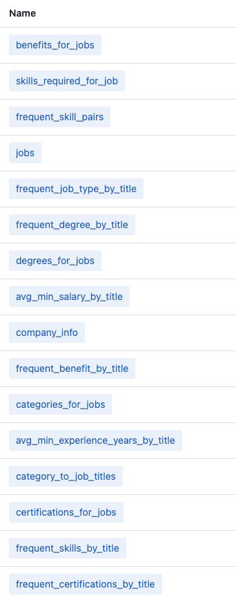

# blue-examples

In this repo you can find many example demonstrations of blue agents and template agent code.

To try demos:
* Go to [demos](demos) page and explore base and experimental agents

Or you can check out:
* [template](agents/template): a template starter agent
* [interactive template](agents/template_interactive): a template starter agent with interactive forms

## example data

As part of installation, there is example data you can explore blue with, as shown below:

To allow blue agents discover the example data you will need to sync to extract schema and other metadata into the data registry.
You can do so using the blue web application. Once logged in, first click in `Data` under registries, and then click on `postgres_example` dataset in the registry. 
Then, select `Actions` and `Sync`.

If you reload the page now you should see `postgres` database listed under `Databases`. If you click click on `postgres` and then `public` you can explore the database schema.

You are now ready to play with this dataset in the examples!
