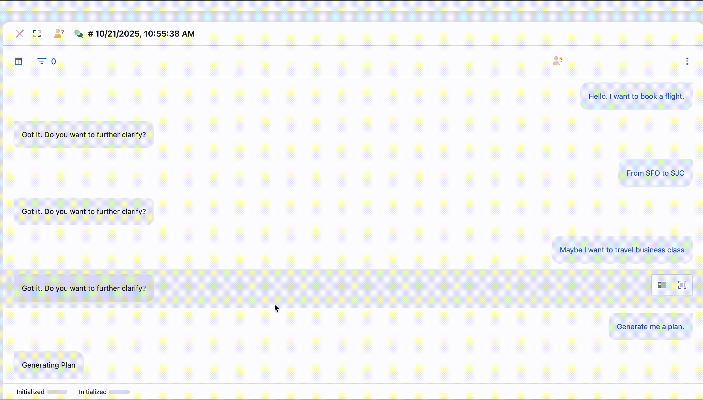
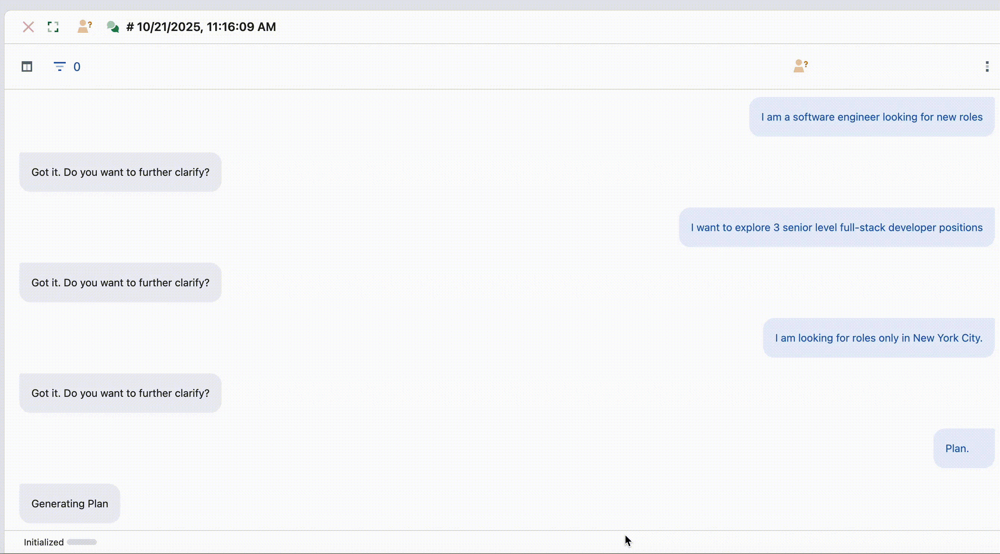

# Dialogue Manager

The Dialogue Manager is responsible for handling interactions with the USER and coordinating different actions and responses based on the user input.

The current version of the Dialogue Manager supports:

1. **Conversation Memory**: Storing, managing and retrieving the conversation thread with USER in current session. 
2. **Intent Rewriting**: Rewriting the USER-ASSISTANT conversation to a concise, well-informed summary capturing the user's intent. 
3. Integration with the `Basic LLM Planner` to output a decomposed task plan, given the user input
4. **Re-plan**: allow user to update or further specify intents to re-plan

## Usage

1. To try out a demo of the `DIALOGUE_MANAGER`, you may utilize an automatic way to update the agent registry 
```
cd agents/dialogue_manager
blue registry agent update agent.json
```

2. Build `DIALOGUE_MANAGER` and `BASIC_LLM_PLANNER` agents

```
cd agents/dialogue_manager
./docker_build_agent.sh
```

```
cd agents/basic_llm_planner
./docker_build_agent.sh
```

3. From the UI, deploy the agents: `COORDINATOR`, `DIALOGUE_MANAGER`, `BASIC_LLM_PLANNER`, `OPENAI`, `BLOCKING_OPENAI`. 

You may now start the `dialogue_manager` demo on the Applications page, kindly refer to some sample conversations outlined in the [Demo](#demo) below.

Alternatively, you may define the agents manually in the UI
 

1. Create a `DIALOGUE_MANAGER` agent, and add a derived `DIALOGUE_MANAGER___EXAMPLE` agent with the following configuration
 ```python
    {
    "intent_rewriter_agent": "OPENAI___INTENT_REWRITER",
    "llm_planner": "BASIC_LLM_PLANNER___DM",
    "conversation_memory": true,
    "use_intent_rewrite": true
}
```
`use_intent_rewrite`: set to True, to utilize intent rewriting

`conversation_memory`: set to True, to store and manage entire conversation history with user. If to use only latest user utterance, set to False. 

2. Create a derived `OPENAI___INTENT_REWRITER` and deploy.
```json
{
    "input_template": "Summarize the following USER-ASSISTANT conversation into a single, concise sentence describing the user's intended task. The summary should reflect the user's goal or intent, in an instruction style. Do not introduce new information. Only include what is stated or clearly implied. Respond only with JSON in the following format, nothing else. JSON response format: {\"rewrite\": \"<your_rewrite>\"}. Input: ${input}"
}
```
- Add output `DEFAULT` with tag `HIDDEN`


3. Create and deploy a derived [`BASIC_LLM_PLANNER___DM`](https://github.com/megagonlabs/blue-examples/tree/v1.0b/agents/basic_llm_planner/src) agent with the following additional properties:
```json
"executor.plan_return_to_agent": "DIALOGUE_MANAGER___EXAMPLE"
"executor.plan_return_to_agent_input":"FROM_PLANNER"
"plan_only_mode": true
```
Also modify 
```json
"decomposer.task_description": "You're tasked with decomposing a user task into a plan with subtasks"
```

- Set `plan_only_mode` to `false` to also perform execution of plan

- Add input `DEFAULT` which excludes `USER`
- Add output `DEFAULT` with tag `HIDDEN`

4. Deploy `BLOCKING_OPENAI`
```json
{
    "include_extra_input": true,
    "wait_for_inputs": ["DEFAULT"],
    "service_url": "ws://blue_service_openai:8001"
}
```
5. Deploy the `COORDINATOR`, `OPENAI AGENT` 

6. Start new session with `COORDINATOR`, `DIALOGUE_MANAGER___EXAMPLE`, `BASIC_LLM_PLANNER___DM`, `OPENAI___INTENT_REWRITER`.

### Demo 

With `plan_only_mode` as `true`, you can start with a vague task such as "I want to book a flight" and further clarify your task and ask to generate a plan.



You may also set `plan_only_mode` to `true` and input a task like "I am searching for jobs", and further clarify with the location, or type of job you are searching for. 



