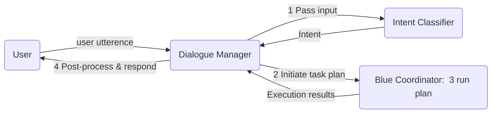

# Simple Chat app using Dialogue Manager Agent

This example demonstrates how to build a simple chat application that interacts with users by leveraging a dialogue manager and a set of Blue agents.

Imagine having access to a multi-modal data source about the local job market, equiped with agents capable of converting natural language into data queries (e.g., NL2SQL). Using these resources, the chat app assists job seekers in exploring market trends and finding job opportunities.

For demonstration purposes, we focus on three user intents: **investigate**, **job_search**, and **summarize**.

## Dialogue Manager in action

As shown in this example animation, the user can ask investigating questions, search for job openings or get summarized insights about several jobs.

[TODO: Animation]

## How it works

1. The dialogue manager continuously listens for user input and passes it to an intent classification agent.
2. Once the intent is identified, the dialogue manager initiates a task plan. (In this demo, plans for each intent class are predefined for simplicity. In a more practical scenario, a more intelligent planning agent would be invoked.)
3. The Blue coordinator picks up and executes the plan.
4. Upon completion, the execution results are returned to the dialogue manager, which may perform optional post-processing before presenting the response to the user.

## Try it out

### Prerequisites.

To try this out, you'll need to deploy the dialogue manager agent, and create a session with the required agents, make sure the data source is corrected registered and available.

[TODO: pointer to Blue installer instruction with agent group]

Agent list:

-   OPENAI\_\_\_EXTRACTOR
-   OPENAI\_\_\_ROGUEAGENT
-   COORDINATOR
-   OPENAI\_\_\_CLASSIFIER
-   QUERYEXECUTOR
-   OPENAI\_\_\_SUMMARIZER
-   DialogManager
-   NL2SQL
    database: sghr

### Example Utterances

| **Natural Language Utterance**                                              | **Intent**  | **Action**                                                    |
| --------------------------------------------------------------------------- | ----------- | ------------------------------------------------------------- |
| what is the most frequently advertised manager role in jurong?              | investigate | NL2SQL->QUERYEXECUTOR                                         |
| I'm looking for a job of a project manager in jurong                        | job_search  | OPENAI\_\_\_EXTRACTOR-> NL2SQL -> QUERYEXECUTOR               |
| I want a summary of the top 5 jobs with the highest minmum salary in jurong | summarize   | OPENAI\_\_\_EXTRACTOR-> NL2SQL -> QUERYEXECUTOR -> SUMMARIZER |
| I want help improving my resume                                             | OOD         | falls back to default ROGUEAGENT                              |
