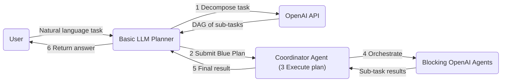

# Basic LLM Planner

This is a basic implementation of an LLM (Large Language Model) planner. The goal of this planner is to take a high-level task description and break it down into smaller, manageable sub-tasks that can be executed by an LLM.

- **Input:** A task expressed in natural language, which may be the output of the intent understanding module in a dialogue interface. The input is assumed to be fully specified and unambiguous.
- **Output:** The decomposed task plan, represented in two forms:
   - A directed acyclic graph (DAG) in JSON format, returned to the user-facing UI
   - A Blue Plan object. If a coordinator exists in a session, the plan will be picked up and executed.

## Flow Diagram

1. The user provides a natural language task to the Basic LLM Planner.
2. The planner calls the OpenAI API to decompose the task into a DAG of sub-tasks.
3. The planner compiles the DAG into [`AgenticPlan`](https://blue.megagon.info/latest/references/blue/agents/plan.html) and submits it.
4. [`CoordinatorAgent`](https://blue.megagon.info/latest/references/blue/agents/coordinator.html) picks up the plan and orchestrates execution of sub-tasks.
5. Each sub-task is executed by a Blocking OpenAI agent, with dependencies handled via the `wait_for_inputs` mechanism.
6. Upon completion, the execution results are returned to the planner.
7. The planner returns the final answer to the user.



## Try it out

To try out the agent, first add the agent to the agent registry and then follow the [quickstart guide](https://github.com/rit-git/blue/blob/dev/QUICK-START.md) to deploy the agent.

To add agent to the registry:

```bash
cd agents/basic_llm_planner
blue registry agent update agent.json
```

and follow the steps interactively.

Additionally, to try out this demo, deploy the `Basic LLM Planner` (`BASIC_LLM_PLANNER`), `OpenAI Blocking Agent` (`BLOCKING_OPENAI`), and `Task Coordinator Agent` (`COORDINATOR`).

To start a session with all these agents, you can simply go to the Blue home page and click `Try out the Basic LLM Planner agent`.

**Example Input**

- What's (1 + 2) - (3 * 4) + sqrt(16)?
  - The planner will decompose the task into multiple steps:
    1. Calculate (1 + 2)
    2. Calculate (3 * 4)
    3. Calculate sqrt(16)
    4. Combine the results from steps 1, 2, and 3 to get the final answer.
- Tell me about Mountain View, California. Include its population, main industries, and notable landmarks.
  - The planner will decompose the task into multiple steps (Note: By default, the execution agent performs pure LLM reasoning without using external data sources or tools):
    1. Identify the population of Mountain View, California.
    2. Identify the main industries in Mountain View, California.
    3. Identify notable landmarks in Mountain View, California.
    4. Compile the information from steps 1, 2, and 3 into a coherent summary.
