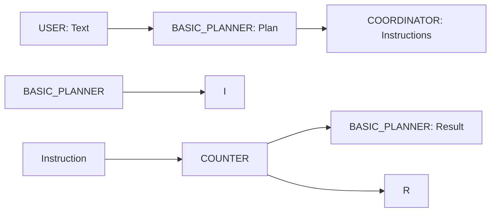

# Basic Planner

Basic Planner is an agent to demonstrate basic functioning of a plan. A plan is declarative specification of a workflow where inputs and outputs from various agents are connected to achieve an outcome. See [Plan](https://github.com/rit-git/blue/tree/v0.9/agents) in the development guide for more detailed description.

The basic planner simply creates a plan, comprised of:
* an input variable, `I`, with a value
* an output variable, `R`, to collect the result
and connects:
* I to `COUNTER` agent, `DEFAULT` input
* `COUNTER` agent, 'DEFAULT` output to `R`, as well as,
* `COUNTER` agent, 'DEFAULT` back to `BASIC_PLANNER` agent input `RESULT`,
  
Plan object is then written to the stream and with the help of the `COORDINATOR` agent it is executed.

---

## Features

- **Plan:** Uses plan to define a workflow
- **Coordinator Agent:** Coordinates the execution of the plan issuing instructions to agents
  
---

## Input & Output

### Input

- **RESULT:** Captures result of the plan.

### Output

- **DEFAULT:** Plan written, tagged with `PLAN`

---

## Properties

- **Listener:**
  - `listens.DEFAULT`: Includes "USER" to listen to USER agent output, only to trigger plan execution.

### Configuration (UI)

None required

---

## Flow Diagram

Below is an overview of the process flow for the Counter agent:

---

## Code Overview

The `BASIC_PLANNER` agent is defined [here](https://github.com/rit-git/blue-examples/blob/v0.9/agents/basic_planer/src/basic_planner_agent.py)

- **Processing:**
  - Plan object created, and submitted
  - Result processed and displayed

---

## Try it out

To try out the agent, first follow the [quickstart guide](https://github.com/rit-git/blue/blob/v0.9/QUICK-START.md) to deploy the agent.

Once deployed create a new session and add the `Basic Planner` (`BASIC_PLANNER`), `Counter Example` (`COUNTER`), `Task Coordinator` (`COORDINATOR`) agents to the session.

In the UI, enter some text.

| **User Input** | **Result** |
|--------------------------------|---------|
| 'go' | -- |

