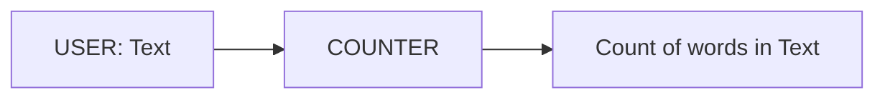

# Counter Agent

Counter is an agent to demonstrate basic functioning of an agent. It simply appends incoming data from the input stream into agent memory and when data from the stream is finished. It calculates the number of words and returns it. 

The following animation displays a user entering some text and the counter agent responding.

---

## Features

- **Agent Memory:** Uses agent memory to temporarily store incoming data

---

## Input & Output

### Input

- **User Text:** A text string representing the user's input.

### Output

The agent outputs a number representing the number of words in input:

---

## Properties

- **Listener:**
  - `listens.DEFAULT`: Includes "USER" to listen to USER agent output

### Configuration (UI)

None required

---

## Flow Diagram

Below is an overview of the process flow for the Counter agent:

---

## Code Overview

The `COUNTER` agent is defined [here](https://github.com/rit-git/blue-examples/blob/v0.9/agents/counter/src/counter_agent.py)

- **Processing:**
  - Each data message is added to agent memory
  - Upon receiving EOS message, stream data is retrieved from memory and word count is computed
  - Processor returns count and EOS, written to the output stream

---

## Try it out

To try out the agent, first follow the [quickstart guide](https://github.com/rit-git/blue/blob/v0.9/QUICK-START.md) to deploy the agent.

Once deployed create a new session and add the `Counter Example` (`COUNTER`)agent to the session.

In the UI, enter some text.

| **User Input** | **Result** |
|--------------------------------|---------|
| what is the most frequently advertised manager role in jurong? | 10 |
| what is the average minimum salary of project manager jobs in jurong? | 12 |

