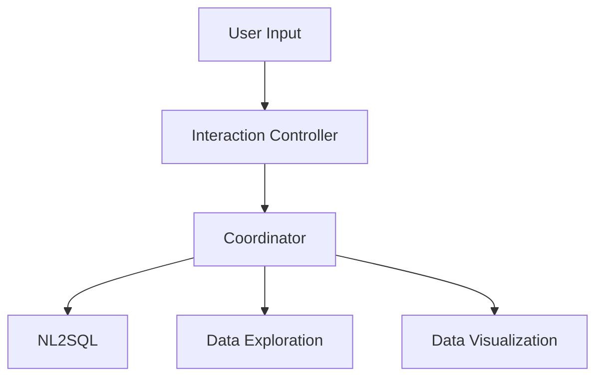

# Data Explorer and Visualization

An autonomous agentic system that can explore datasets, generate visualizations, and handle open-ended queries.

- **Automated Data Profiling:** Column classification, statistics, and insight generation
- **Dynamic Visualization:** Interactive Vega-Lite charts and dashboards
- **Natural Language to SQL:** Convert questions into executable queries
- **Data-Aware Planning:** Intelligent orchestration based on data registry metadata

## Installation

To install please follow the [installation instructions](installation.md)

## Try it out

Please follow the [demo example](demo_example.md) to try it out.

TODO: add gifs here

## Core Problem

Working with data often involves:
- **Time-consuming manual EDA:** Understanding new datasets requires repetitive profiling work
- **Disconnected workflows:** Separate tools for querying, analysis, and visualization
- **Context switching:** Users must translate between natural language intent and technical queries

## Solution

### Automated Data Exploration and Visualization
Enables users to understand their data using automated column classification, statistical profiling, and insight generation, and to represent insights clearly through automatically generated visualizations.

### Unified Natural Language Interface
Allows users to express exploration and visualization needs in plain language, with the system automatically routing requests to appropriate agents
 

## Architecture

This demo orchestrates five agents working together:

| Agent | Description |
|-------|-------------|
| **Interaction Controller** | Routes user requests, manages conversation memory, and generates execution plans |
| **Data Exploration Agent** | Performs automated EDA: column classification, statistics, and insights |
| **Data Visualization Agent** | Generates interactive Vega-Lite v5 visualizations using a ReAct approach |
| **NL2SQL Agent** | Converts natural language questions to SQL queries (shipped with Blue) |
| **Task Coordinator Agent** | Coordinates task execution across agents (shipped with Blue) |

### Workflow

# Disclosures:

This software may include, incorporate, or access open source software (OSS) components,
datasets and other third party components, including those identified below. The license terms
respectively governing the datasets and third-party components continue to govern those
portions, and you agree to those license terms may limit any distribution, use, and copying.
You may use any OSS components under the terms of their respective licenses, which may
include BSD 3, Apache 2.0, and other licenses. In the event of conflicts between Megagon Labs,
Inc. (“Megagon”) license conditions and the OSS license conditions, the applicable OSS
conditions governing the corresponding OSS components shall prevail.
You agree not to, and are not permitted to, distribute actual datasets used with the OSS
components listed below. You agree and are limited to distribute only links to datasets from
known sources by listing them in the datasets overview table below. You agree that any right to
modify datasets originating from parties other than Megagon are governed by the respective
third party’s license conditions.
You agree that Megagon grants no license as to any of its intellectual property and patent rights.
THIS SOFTWARE IS PROVIDED BY THE COPYRIGHT HOLDERS AND CONTRIBUTORS (INCLUDING
MEGAGON) “AS IS” AND ANY EXPRESS OR IMPLIED WARRANTIES, INCLUDING, BUT NOT LIMITED
TO, THE IMPLIED WARRANTIES OF MERCHANTABILITY AND FITNESS FOR A PARTICULAR
PURPOSE ARE DISCLAIMED. IN NO EVENT SHALL THE COPYRIGHT HOLDER OR CONTRIBUTORS BE
LIABLE FOR ANY DIRECT, INDIRECT, INCIDENTAL, SPECIAL, EXEMPLARY, OR CONSEQUENTIAL
DAMAGES (INCLUDING, BUT NOT LIMITED TO, PROCUREMENT OF SUBSTITUTE GOODS OR
SERVICES; LOSS OF USE, DATA, OR PROFITS; OR BUSINESS INTERRUPTION) HOWEVER CAUSED
AND ON ANY THEORY OF LIABILITY, WHETHER IN CONTRACT, STRICT LIABILITY, OR TORT
(INCLUDING NEGLIGENCE OR OTHERWISE) ARISING IN ANY WAY OUT OF THE USE OF THIS
SOFTWARE, EVEN IF ADVISED OF THE POSSIBILITY OF SUCH DAMAGE. You agree to cease using,
incorporating, and distributing any part of the provided materials if you do not agree with the
terms or the lack of any warranty herein.
While Megagon makes commercially reasonable efforts to ensure that citations in this
document are complete and accurate, errors may occur. If you see any error or omission, please
help us improve this document by sending information to contact_oss@megagon.ai.

## Datasets
| ID  | OSS Component Name | Modified | Copyright Holder | Upstream Link | License  |
|-----|----------------------------------|----------|------------------|-----------------------------------------------------------------------------------------------------------|--------------------|

## Open Source Software (OSS) Components 
All OSS components used within the product are listed below (including their copyright holders and the license information).

For OSS components having different portions released under different licenses, please refer to the included Upstream link(s) specified for each of the respective OSS components for identifications of code files released under the identified licenses.

 

| ID  | OSS Component Name | Modified | Copyright Holder | Upstream Link | License  |
|-----|----------------------------------|----------|------------------|-----------------------------------------------------------------------------------------------------------|--------------------|
