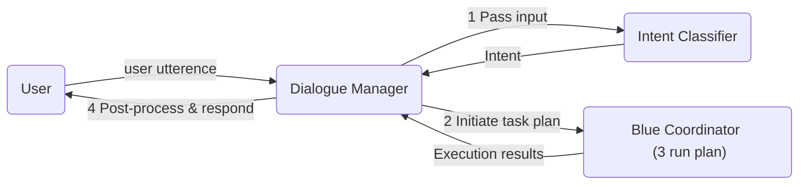

# Simple Chat app using Dialogue Manager Agent

This example demonstrates how to build a simple chat application that interacts with users by leveraging a dialogue manager and a set of Blue agents.

Imagine having access to a multi-modal data source about the local job market, equiped with agents capable of converting natural language into data queries (e.g., NL2SQL). Using these resources, the chat app assists job seekers in exploring market trends and finding job opportunities.

For demonstration purposes, we focus on three user intents: **investigate**, **job_search**, and **summarize**.

1. investigate: The user is requesting job market statistics or insights that can be fulfilled by a single SQL query (e.g., "What is the average salary for data scientists in Jurong?").
2. job_search: The user is searching for job postings that match specific criteria (e.g., "Show me remote software engineer jobs with at least 5 years of experience.").

3. summarize: The user wants a summary or aggregated insights over a group of job postings (e.g., "Summarize the key skills required for product management roles.").

4. OOD (Out of Domain): The user’s request does not fit into any of the above categories.

## Dialogue Manager in action

As shown in this example animation, the user can ask investigating questions, search for job openings or get summarized insights about several jobs.

## How it works

1. The dialogue manager continuously listens for user input and passes it to an intent classification agent.
2. Once the intent is identified, the dialogue manager initiates a task plan. (In this demo, plans for each intent class are predefined for simplicity. In a more practical scenario, a more intelligent planning agent would be invoked.)
3. The Blue coordinator picks up and executes the plan.
4. Upon completion, the execution results are returned to the dialogue manager, which may perform optional post-processing before presenting the response to the user.

## Try it out

## Prerequisites

1. **Install and deploy blue orchastration platform:** Follow the link here (TODO: add public link). Agents and data used in this demo will be automatically loaded at installation.
2. **Deploy agents:** In the Agent Registry, deploy the following agents. To deploy an agent, go to its correpsonding agent card, click the `Actions` button on the top righ corner, and then click `Deploy`.
    1. Dialogue Manager
    2. OpenAI Agent
    3. NL-to-SQL Agent
    4. Task Coordinator Agent
    5. Query Executor Agent
3. **Sync data:** In the Data Registry, go to the data card of the example db `postgres_example` and click `Actions-> Sync`.
4. **Start a session** with pre-configured agent group and try it out. To do so, go to the Blue home page and click `Test the Dialogue Manager`

### Example Utterances

| **Natural Language Utterance**                                                     | **Intent**  | **Action**                                                                |
| ---------------------------------------------------------------------------------- | ----------- | ------------------------------------------------------------------------- |
| I want to investigate the 10 most common skills required for project manager jobs  | investigate | NL2SQL->QUERYEXECUTOR                                                     |
| I'm looking for a job of a project manager in jurong with a minimum salary of 4000 | job_search  | OPENAI\_\_\_EXTRACTOR-> NL2SQL -> QUERYEXECUTOR                           |
| Please generate a report for the top 5 project manager jobs in jurong              | summarize   | OPENAI\_\_\_EXTRACTOR-> NL2SQL -> QUERYEXECUTOR -> OPENAI\_\_\_SUMMARIZER |
| I want help improving my resume                                                    | OOD         | falls back to default ROGUEAGENT                                          |
