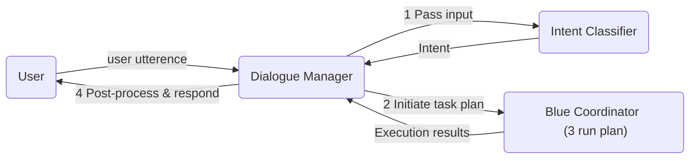

# Dialogue Manager Agent for Chat Applications

Dialogue Manager is an agent to help developers build chat applications. It demonstrates use of `OPENAI Intent Classifier Agent`(OPENAI___INTENT_CLASSIFIER) to identify intent and then map intents to plans to execute a series of agents to respond to user's intent. See [Plan](https://github.com/rit-git/blue/tree/v0.9/agents) in the development guide for more detailed description.

This demo shows how to build a simple chat application that interacts with users by leveraging the Dialogue Manager and a set of other agents.

The following animation displays the Dialogue Manager in action for a job search use case, assists job seekers in exploring market trends and finding job opportunities:

In the above example, there are three intents: **investigate**, **job_search**, and **summarize**.

1. investigate: The user is requesting job market statistics or insights that can be fulfilled by a single SQL query (e.g., "What is the average salary for data scientists in Jurong?").
2. job_search: The user is searching for job postings that match specific criteria (e.g., "Show me remote software engineer jobs with at least 5 years of experience.").

3. summarize: The user wants a summary or aggregated insights over a group of job postings (e.g., "Summarize the key skills required for product management roles.").

4. OOD (Out of Domain): The user’s request does not fit into any of the above categories.

## Flow Diagram

1. The Dialogue Manager continuously listens for user input and passes it to the Intent Classifier agent.
2. Once the intent is identified, the Dialogue Manager initiates a task plan. (Note: In this demo, plans for each intent class are predefined for simplicity. In a more practical scenario, a more intelligent planning agent would be invoked)
3. The Task Coordinator picks up the plan and start execution.
4. Upon completion, the execution results are returned to the Dialogue Manager, which may perform optional post-processing before presenting the response to the user.

## Try it out

This demo uses the example data `postgres_example` and `OPENAI` service. Please make sure to follow the aditional steps required to get them ready in the blue-examples [documentation](https://github.com/rit-git/blue-examples/tree/v0.9?tab=readme-ov-file#blue-examples)

Additionally, to try out this demo, follow the [quickstart guide](https://github.com/rit-git/blue/blob/v0.9/QUICK-START.md) to deploy the `Dialogue Manager` (`DIALOGUE_MANAGER`), `OpenAI Agent` (`OPENAI`), `Query Executor Agent` (`QUERY_EXECUTOR`),  `NL-to-SQL Agent` (`NL2SQL`), and `Task Coordinator Agent` (`COORDINATOR`).

To start a session with all these agents, you can simply go to Blue home page and click `Try out the Dialogue Manager`

### Example Utterances

| **Natural Language Utterance**                                                     | **Intent**  | **Action**                                                                |
| ---------------------------------------------------------------------------------- | ----------- | ------------------------------------------------------------------------- |
| I want to investigate the 10 most common skills required for project manager jobs  | investigate | NL2SQL->QUERYEXECUTOR                                                     |
| I'm looking for a job of a project manager in jurong with a minimum salary of 4000 | job_search  | OPENAI\_\_\_EXTRACTOR-> NL2SQL -> QUERYEXECUTOR                           |
| Please generate a report for the top 5 project manager jobs in jurong              | summarize   | OPENAI\_\_\_EXTRACTOR-> NL2SQL -> QUERYEXECUTOR -> OPENAI\_\_\_SUMMARIZER |
| I want help improving my resume                                                    | OOD         | falls back to default ROGUEAGENT                                          |
