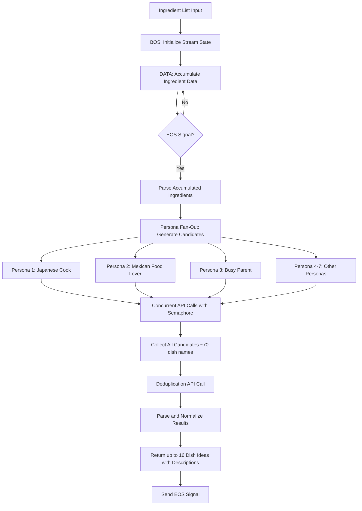

# Dish Ideation Agent

`Dish Ideation Agent` is an OpenAI-based agent that generates diverse, creative dish name candidates from a list of available ingredients. The agent uses a **persona fan-out strategy** to ensure variety: it queries OpenAI's API multiple times with different culinary personas (e.g., Japanese home cook, busy parent, college student), then merges and deduplicates the results to produce a final set of up to 16 unique dish ideas with short descriptions.

## Dish Ideation Agent in Action

<!-- TODO: Add demo GIF showing ingredient input and dish idea generation -->
*Demo placeholder: Input ingredients → Persona fan-out → Deduplicated dish ideas with descriptions*

---

## Features

- **Persona-Based Diversity:** Uses multiple culinary personas to generate varied dish ideas (e.g., Japanese, Mexican, Indian, athlete-focused, beginner-friendly)
- **Parallel Processing:** Executes persona API calls concurrently using asyncio using `ServiceClient.async_call_service()` for fast response times
- **LLM-based Deduplication:** Normalizes and deduplicates similar dish names using LLM-based similarity detection
- **Structured JSON Output:** Returns a list of dish ideas with names and short descriptions

---

## Input & Output

### Input

The agent expects a dictionary or JSON string containing a list of ingredients:

- **Ingredient Data:**
  ```json
  {
    "ingredients": ["chicken thigh", "broccoli", "garlic", "leftover rice", "eggs", "soy sauce"]
  }
  ```
  - `ingredients`: Array of strings, each representing an available ingredient.

### Output

The agent outputs a JSON object (`dict`) containing the generated and deduplicated dish ideas:

```json
{
  "dish_ideas": [
    {
      "name": "Garlic Chicken Fried Rice",
      "short_description": "A savory stir-fried rice dish with tender chicken, crisp broccoli, and aromatic garlic in soy sauce.",
      "ingredient_list": ["chicken thigh", "broccoli", "garlic", "leftover rice", "eggs", "soy sauce"]
    }
  ]
}
```

**Fields:**

- **dish_ideas:** Array of objects, each containing:
  - `name`: The Title Case name of the dish (2-7 words).
  - `short_description`: A 1-2 sentence description of the dish's flavor and cooking technique.
  - `ingredient_list`: A copy of the original input ingredient list for reference.

**Note:** The agent guarantees diverse suggestions across cuisines, cooking techniques, and meal types.

---

## Properties

The agent uses a set of properties to control the persona fan-out and deduplication process. The agent extends [`OpenAIAgent`](https://blue.megagon.info/latest/references/blue/agents/openai.html) and **supports all properties from the base OpenAIAgent class**. Core properties are denoted in bold.

- **OpenAI API Configuration:**
  - `service_url`: WebSocket URL for the OpenAI service (`ws://blue_service_openai:8001`).
  - `openai.model`: OpenAI model to use for generation (`"gpt-4.1-mini"`).
  - `openai.max_tokens`: Maximum tokens for API responses (`5000`).

- **Ideation & Deduplication Parameters:**
  - **`n_candidates_per_persona`**: Number of dish names generated per persona (`10`).
  - **`max_n_candidates`**: Maximum number of final deduplicated dish ideas to return (`16`).
  - **`max_concurrent_requests`**: Maximum concurrent API calls during persona fan-out (`10`).

- **Persona Configuration:**
  - **`ideation_personas`**: List of culinary personas used for diverse generation. Default includes 7 personas focusing on various dietary needs and cooking styles.

- **Input/Output Settings:**
  - `input_json`: Template for OpenAI message structure (`[{"role": "system"}, {"role": "user"}]`).
  - `input_template`: Template for user input substitution (`"${input}"`).
  - `system_context`: JSONPath to system message in `input_json` (`"$[0]"`).
  - `input_context`: JSONPath to user message in `input_json` (`"$[1]"`).

- **Prompt Configuration:**
  - **`ideation_system_prompt_template`**: Instructions for persona-based generation (supports `${persona}` and `${n_candidates_per_persona}` variables).
  - **`ideation_user_prompt_template`**: User prompt template (`"You have the following ingredients available: ${input}"`).
  - **`deduplication_system_prompt_template`**: Instructions for merging and normalization (supports `${max_n_candidates}` variable).
  - **`deduplication_user_prompt_template`**: User prompt template (`"Here is the list of dish names: ${input}"`).

- **Structured Output Configuration:**
  - **`ideation_response_format`**: JSON schema definition for structured dish name list.
  - **`deduplication_response_format`**: JSON schema definition for final dish ideas with descriptions.

### Configuration (UI)

<!-- TODO: Add screenshot showing agent properties configuration in UI -->
*Users can modify all agent properties from the Blue platform UI to customize personas, adjust candidate counts, and fine-tune prompt templates.*

---

## Flow Diagram

Below is an overview of the process flow for the Dish Ideation agent:



---

## Code Structure of Dish Ideation Agent

The `DishIdeationAgent` agent is defined in [dish_ideation_agent.py](src/dish_ideation_agent.py).

### Class Definition

- `DishIdeationAgent` extends `OpenAIAgent` to leverage GPT models for creative dish name generation.

### Message Processing

- **`default_processor` method** handles incoming stream messages:
  1. **BOS (Begin of Stream):** Initializes accumulator for ingredient data
  2. **DATA:** Accumulates ingredient data from the stream
  3. **EOS (End of Stream):** Triggers the main workflow:
     - Parse accumulated ingredient data
     - Generate candidates using persona fan-out
     - Deduplicate and normalize results
     - Return structured output with EOS signal

### Core Methods

#### `_generate_all_candidates(ingredients, properties)`

- Orchestrates persona fan-out using asyncio for parallel execution
- Creates concurrent API calls for all personas (limited by semaphore)
- Returns combined list of all generated dish names

#### `_call_ideation_for_persona(persona, ingredients, semaphore, properties)`

- Async method that generates dish names for a single persona
- Constructs system and user prompts with persona context
- Uses structured output (JSON schema) to ensure valid responses
- Returns list of dish name strings for the persona

#### `_deduplicate_and_normalize(all_candidates, properties)`

- Takes all generated dish names and deduplicates using LLM
- Applies normalization rules (Title Case, 2-7 words, no special characters)
- Adds short descriptions to each dish
- Returns list of dict objects with `name` and `short_description` keys

#### `create_message(input_data, properties, additional_data)`

- Overrides `ServiceClient.create_message()` to support system prompt injection
- Substitutes template variables (e.g., `${persona}`, `${input}`, `${max_n_candidates}`)
- Constructs message structure compatible with OpenAI's API format

### Performance Optimization

- **Async/Await:** Uses asyncio to execute persona API calls concurrently
- **Semaphore Control:** Limits concurrent requests to prevent overwhelming the service
- **Logging:** Includes performance timing logs for profiling

### Error Handling

- Gracefully handles JSON parsing errors during API response processing
- Returns empty lists on failure to prevent downstream crashes
- Logs warnings and errors for debugging

---

## Try it out

<!-- TODO: Add instructions for deploying and testing the agent -->

*To try out the Dish Ideation Agent:*

1. Deploy the agent to your Blue platform instance
2. Provide a list of available ingredients (e.g., from the Ingredient Extractor agent or manual input)
3. The agent will generate diverse dish ideas with short descriptions

**Example Ingredient Lists to Try:**

| **Input Ingredients** | **Expected Output Variety** |
|----------------------|------------------------------|
| `{"ingredients": ["chicken", "rice", "soy sauce", "garlic", "broccoli"]}` | Asian-inspired stir-fries, bowls, fried rice variations |
| `{"ingredients": ["pasta", "tomatoes", "basil", "mozzarella", "olive oil"]}` | Italian classics like pasta pomodoro, caprese variations, baked dishes |
| `{"ingredients": ["ground beef", "tortillas", "cheese", "lettuce", "salsa"]}` | Mexican-inspired tacos, burritos, taco bowls, quesadillas |
| `{"ingredients": ["tofu", "bell peppers", "soy sauce", "ginger", "rice noodles"]}` | Vegetarian Asian noodle dishes, stir-fries, and bowls |
| `{"ingredients": ["eggs", "bread", "cheese", "butter", "milk"]}` | Breakfast and brunch ideas like sandwiches, scrambles, French toast |

**Expected Workflow:**

If default properties are used, the typical workflow is:

1. **Input:** List of 5-10 ingredients
2. **Processing:** Agent queries 7 personas in parallel (~15 seconds)
3. **Deduplication:** Merges and normalizes ~70 candidates (~5 seconds)
4. **Output:** up to 16 unique dish ideas with descriptions

**Performance Notes:**

- Typical execution time: 10-20 seconds for full workflow.
- Parallel processing significantly reduces latency compared to sequential calls.
- Semaphore limits prevent service overload while maintaining speed.
