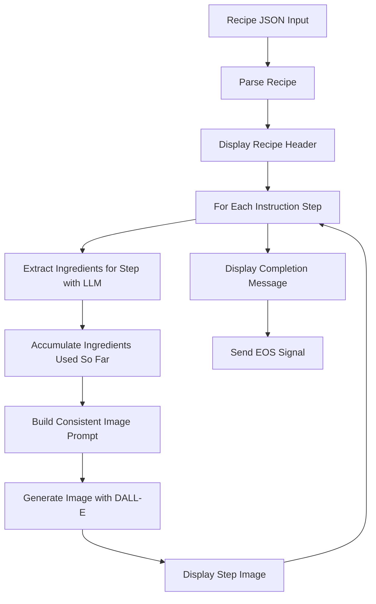

# Image Generator Agent

`Image Generator Agent` creates step-by-step visual guides for recipes using DALL-E. The agent takes a recipe with dish name, ingredients, and instructions as input, intelligently extracts ingredients used in each step, and generates anime-style images for each cooking step with consistent visual styling.

## Image Generator Agent in Action

<!-- TODO: Add demo GIF showing recipe input and step-by-step image generation -->
*Demo placeholder: Recipe input → Ingredient extraction per step → DALL-E image generation → Visual cooking guide*

---

## Features

- **Step-by-Step Image Generation:** Generates a unique image for each cooking instruction step
- **Intelligent Ingredient Extraction:** Uses GPT to determine which ingredients appear in each step
- **Cumulative Ingredient Tracking:** Only shows ingredients that have been used up to the current step
- **Consistent Visual Style:** Anime art style with Studio Ghibli-inspired food illustrations
- **Recipe Parsing:** Accepts JSON recipe format or uses GPT to parse unstructured recipe text
- **Rich Markdown Output:** Displays recipe header, ingredients list, and step images with instructions

---

## Input & Output

### Input

The agent expects a JSON object containing recipe details:

```json
{
  "dishName": "Garlic Butter Shrimp Pasta",
  "description": "A quick and flavorful pasta dish with succulent shrimp in garlic butter sauce",
  "ingredients": [
    "shrimp",
    "pasta",
    "garlic",
    "butter",
    "olive oil",
    "parsley",
    "lemon juice",
    "salt",
    "pepper"
  ],
  "instructions": [
    "Cook pasta according to package directions, drain and set aside",
    "Melt butter with olive oil in a large pan over medium heat",
    "Add minced garlic and cook until fragrant, about 1 minute",
    "Add shrimp and cook until pink, about 2-3 minutes per side",
    "Toss in cooked pasta and mix well",
    "Add lemon juice, salt, pepper, and fresh parsley",
    "Serve immediately"
  ]
}
```

**Required fields:**
- `dishName` (string): The name of the dish
- `ingredients` (array): List of ingredients used in the recipe
- `instructions` (array): Step-by-step cooking instructions

**Optional fields:**
- `description` (string): Brief description of the dish

### Output

The agent outputs rich Markdown content with:

1. **Recipe Header:** Dish name, description, and ingredients list
2. **Step Images:** For each instruction step, displays:
   - Step number and instruction text
   - Generated anime-style image (256x256 display size)
3. **Completion Message:** Summary of generated images

Output is rendered as interactive forms in the Blue platform UI.

---

## Properties

The agent uses a set of properties to control image generation and recipe parsing. The agent extends [`OpenAIAgent`](https://blue.megagon.info/latest/references/blue/agents/openai.html) and **supports all properties from the base OpenAIAgent class**. Core properties are denoted in bold.

- **DALL-E Image Configuration:**
  - **`openai.image_model`**: Model for image generation (`"dall-e-3"`).
  - **`openai.image_size`**: Generated image dimensions (`"1024x1024"`).
  - **`openai.image_quality`**: Quality setting for DALL-E 3 (`"standard"` or `"hd"`).
  - **`openai.image_n`**: Number of images per prompt (`1`).

- **Style Configuration:**
  - **`image.style_description`**: Art style description for generated images. Default: anime art style with Studio Ghibli food aesthetics, bright colors, and top-down 45-degree angle view.

- **Prompt Templates:**
  - **`image.prompt_template`**: Template for image generation prompts. Supports variables: `{dish_name}`, `{all_steps_str}`, `{step_num}`, `{current_instruction}`, `{ingredients_in_image}`, `{style_description}`.
  - **`parse_recipe.prompt_template`**: Template for GPT-based recipe parsing from unstructured text.
  - **`extract_ingredients.prompt_template`**: Template for extracting ingredients used in each cooking step.

- **General Settings:**
  - `timeout`: Request timeout in seconds (`30`).
  - `output_strip`: Whether to strip whitespace from output (`true`).
  - `service_url`: WebSocket URL for the OpenAI service.

### Configuration (UI)

<!-- TODO: Add screenshot showing agent properties configuration in UI -->
*Users can modify all agent properties from the Blue platform UI to customize image style, adjust DALL-E settings, and fine-tune prompt templates.*

---

## Flow Diagram

Below is an overview of the process flow for the Image Generator agent:



---

## Code Structure of Image Generator Agent

The `ImageGeneratorAgent` agent is defined in [image_generator.py](src/image_generator.py).

### Class Definition

- `ImageGeneratorAgent` extends `OpenAIAgent` to leverage both GPT models (for parsing and ingredient extraction) and DALL-E (for image generation).

### Message Processing

- **`default_processor` method** handles incoming stream messages:
  1. **BOS (Begin of Stream):** Initializes accumulator for recipe data
  2. **DATA:** Accumulates recipe JSON from the stream
  3. **EOS (End of Stream):** Triggers the main workflow:
     - Parse recipe from JSON
     - Display recipe header with ingredients
     - Generate images for each cooking step
     - Display completion message with EOS signal

### Core Methods

#### `parse_recipe(recipe_input)`

- Parses recipe from JSON format
- Falls back to GPT-based parsing if JSON is malformed
- Returns standardized dict with `dish_name`, `description`, `ingredients`, `instructions`

#### `extract_ingredients_for_step_with_llm(instruction, all_ingredients)`

- Uses GPT to predict which ingredients are used in a specific instruction step
- Validates extracted ingredients against the full ingredient list
- Returns list of ingredients that should appear in the step's image

#### `get_cumulative_ingredients(instructions, all_ingredients, up_to_step)`

- Accumulates ingredients used from step 1 up to the specified step
- Ensures visual consistency by only showing ingredients already used

#### `build_consistent_prompt(dish_name, all_ingredients, all_instructions, step_num, current_instruction, ingredients_used_so_far)`

- Builds detailed prompts for image generation with full recipe context
- Highlights current step while showing completed and upcoming steps
- Applies style description from properties

#### `generate_image_with_dalle(prompt)`

- Calls OpenAI DALL-E API via Blue's service wrapper
- Returns generated image URL or None on failure

#### `display_step_image(image_url, worker, step_num, instruction)`

- Displays step image with instruction using Markdown form

#### `display_recipe_header(recipe, worker)`

- Displays recipe title, description, and ingredients list

### Error Handling

- Gracefully handles JSON parsing errors with GPT fallback
- Displays placeholder images when DALL-E generation fails
- Logs detailed error information for debugging

---

## Try it out

<!-- TODO: Add instructions for deploying and testing the agent -->

*To try out the Image Generator Agent:*

1. Deploy the agent to your Blue platform instance
2. Ensure the OpenAI service is configured with DALL-E access
3. Provide a recipe in JSON format with dish name, ingredients, and instructions
4. The agent will generate anime-style images for each cooking step

**Example Recipe to Try:**

```json
{
  "dishName": "Simple Scrambled Eggs",
  "description": "Fluffy scrambled eggs with butter",
  "ingredients": ["eggs", "butter", "salt", "pepper", "milk"],
  "instructions": [
    "Crack eggs into a bowl and whisk with milk",
    "Melt butter in a non-stick pan over medium-low heat",
    "Pour egg mixture into the pan",
    "Gently stir with a spatula as eggs begin to set",
    "Season with salt and pepper",
    "Remove from heat while still slightly wet"
  ]
}
```

**Expected Workflow:**

If default properties are used, the typical workflow is:

1. **Input:** JSON recipe with dish name, ingredients, and instructions
2. **Processing:** Agent parses recipe and displays header
3. **Image Generation:** For each step, extracts ingredients and generates DALL-E image
4. **Output:** Rich Markdown display with step-by-step visual guide

**Performance Notes:**

- Each DALL-E image generation takes approximately 10-20 seconds
- LLM ingredient extraction adds ~1-2 seconds per step
- Total processing time scales with number of instruction steps
