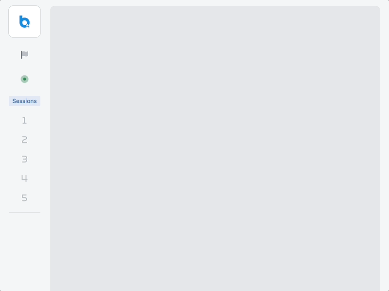
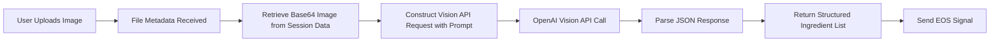

# Ingredient Extractor

`Ingredient Extractor` is an OpenAI-based agent that takes in an uploaded image as input and returns a list of extracted ingredients. The agent leverages OpenAI API's vision capabilities to analyze images (such as photos of refrigerators, pantries, or raw ingredients) and returns a structured list of detected ingredients in JSON format.

## Ingredient Extractor Agent in Action

The following animation displays the user uploading an image of a refrigerator interior, the agent processing the image, and the resulting list of extracted ingredients being returned in the UI.



---

## Features

- **Vision-Based Ingredient Detection:** Uses OpenAI API's vision capabilities to analyze images and identify visible ingredients.
- **File Handling:** Retrieves an uploaded image from session data using a file ID.
- **Structured JSON Output:** Returns ingredients in a standardized JSON format with schema validation.

---

## Input & Output

### Input

The agent expects file metadata containing a reference to an uploaded image:

- **File Metadata:** A dictionary with the following structure (a file upload from the UI):
  ```json
  {
    "file_id": "file:c9450235-6232-4c8b-bfde-d3b3fa93d624",
    "filename": "inside-refrigerator.jpg",
    "content_type": "image/jpeg"
  }
  ```
  - `file_id`: Must correspond to a file stored in the current session data
  - `filename`: Original name of the uploaded file
  - `content_type`: MIME type of the image (typically `image/jpeg` or `image/png`)

### Output

The agent outputs a JSON object (`dict`) containing the extracted ingredients:

```json
{
  "ingredients": [
    "tomatoes",
    "onions",
    "garlic",
    "bell peppers",
    "chicken breast",
    "milk",
    "eggs"
  ]
}
```

**Fields:**
- **ingredients:** Array of strings, each representing a detected ingredient

**Note:** If the agent fails to parse the LLM response, it returns an empty list: `{"ingredients": []}`

---

## Properties

The agent uses a set of properties to control its behavior and configure the OpenAI API integration. Core properties are denoted in bold.

- **OpenAI API Configuration:**
  - `openai.api`: Specifies the API to use (`"ChatCompletion"`).
  - `openai.model`: Model selection (e.g., `"gpt-4.1-mini"`).
  - `openai.max_tokens`: Maximum tokens for the response (e.g., `1024`).
  - `openai.temperature`: Not explicitly set in default config (uses API default).
  - `openai.frequency_penalty`: Set to `0` for standard generation.
  - `openai.presence_penalty`: Set to `0` for standard generation.
  - `openai.top_p`: Set to `1` for full probability distribution.

- **Input/Output Settings:**
  - `input_field`: JSONPath for input messages (`"messages"`).
  - `input_json`: Message structure template (`[{"role": "user"}]`).
  - `input_context_field`: Field for content (`"content"`).
  - `input_context`: Context path (`"$[0]"`).
  - **`input_template`:** Must be `null` (no string substitution).
  - `output_path`: JSONPath to extract the generated output (`$.choices[0].message.content`).
  - `output_strip`: Set to `true` to strip whitespace from output.
  - `output_transformations`: List of text transformations:
    - Remove markdown JSON code fences (````json` → `""`)
    - Remove generic code fences (` ``` ` → `""`)

- **Prompt Configuration:**
  - **`prompt`:** Instructions for the vision model. Default:
    ```
    Do your best to identify all of the visible ingredients in the provided image(s).
    Respond only with the list of ingredients. The response should be formatted as a
    Python list of strings.
    ```

- **Structured Output Configuration:**
  - **`openai.response_format`:** JSON schema definition for strict output validation:
    ```json
    {
      "type": "json_schema",
      "json_schema": {
        "name": "ingredient_extraction",
        "schema": {
          "type": "object",
          "properties": {
            "ingredients": {
              "type": "array",
              "items": {"type": "string"},
              "description": "A list of ingredients extracted from the image"
            }
          },
          "required": ["ingredients"],
          "additionalProperties": false
        },
        "strict": true
      }
    }
    ```

- **Service Configuration:**
  - **`service_url`:** WebSocket URL for the OpenAI service (`ws://blue_service_openai:8001`).

### Configuration (UI)

<!-- TODO: Add screenshot/GIF showing agent properties configuration in UI -->
*Users can modify the agent properties from the UI to adjust the prompt, model selection, and output format preferences.*

---

## Flow Diagram

Below is an overview of the process flow for the Ingredient Extractor agent:



---

## Code Structure of Ingredient Extractor Agent

The `IngredientExtractor` agent is defined in [ingredient_extractor.py](src/ingredient_extractor.py).

- **Class Definition:**
  - `IngredientExtractor` extends `OpenAIAgent` to leverage vision capabilities for image analysis.

- **Message Processing:**
  - `default_processor` method handles incoming messages:
    1. Checks if the message contains data (file metadata)
    2. Retrieves the base64-encoded image from session data using the `file_id`
    3. Constructs a multi-part content payload with the prompt and image
    4. Executes the OpenAI API call with vision capabilities
    5. Parses the JSON response to extract the ingredient list
    6. Returns the structured output with an EOS (End of Stream) signal
  - Note on message construction:
    - If `properties["input_template"]` is `null`, the input data is directly used in the message content
    - This allows passing complex structures (like images) without string substitution
    - See [`ServiceClient.create_message()`](https://blue.megagon.info/latest/references/blue/utils/service_utils.html#blue.utils.service_utils.ServiceClient.create_message) for how messages are constructed.

- **Error Handling:**
  - If JSON parsing fails, logs a warning and returns an empty ingredient list
  - Ensures graceful degradation when the LLM response is malformed

---

## Try it out

<!-- TODO: Add instructions for deploying and testing the agent -->

*To try out the Ingredient Extractor agent:*

1. Deploy the agent to your Blue platform instance
2. Upload an image of ingredients, a refrigerator interior, or a pantry
3. The agent will analyze the image and return a JSON list of detected ingredients

**Example Images to Try:**
- Refrigerator interior photos
- Pantry shelf images
- Raw ingredient collections
- Grocery shopping photos

**Expected Usage Pattern:**

| **Input Image** | **Extracted Output** |
|----------------|---------------------------|
| Refrigerator photo | `{"ingredients": ["milk", "eggs", "butter", "cheese", "lettuce", "tomatoes"]}` |
| Pantry shelf | `{"ingredients": ["flour", "sugar", "rice", "pasta", "olive oil", "canned tomatoes"]}` |
| Raw ingredients | `{"ingredients": ["chicken breast", "onions", "garlic", "bell peppers", "mushrooms"]}` |

*Note: Ingredient detection accuracy depends on image quality and visibility of items.*
