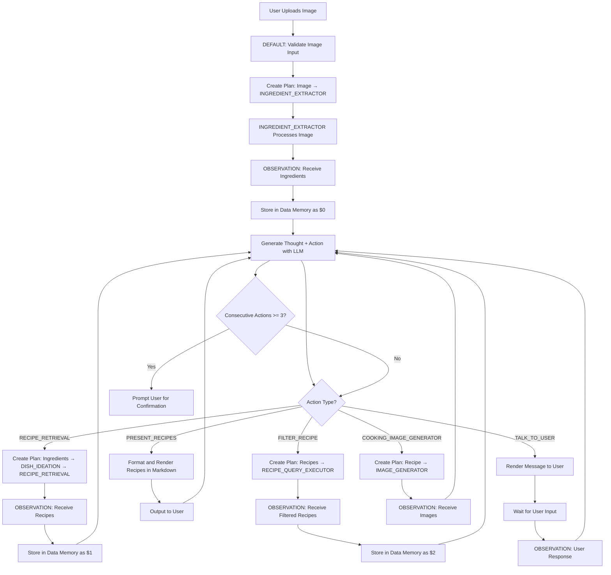

# Reactive Blue Plate Agent

`Reactive Blue Plate Agent` is an intelligent cooking assistant that orchestrates multiple sub-agents using the **ReAct (Reasoning + Acting) framework**. The agent coordinates a complete workflow—from ingredient extraction to recipe retrieval and presentation—by generating thoughts to explain its reasoning and executing actions through specialized sub-agents. It maintains conversation history, manages a memory system for data references, and interacts with users through markdown-rendered messages.

## Reactive Blue Plate Agent in Action

<!-- TODO: Add demo GIF showing image upload → ingredient extraction → dish ideation → recipe retrieval → filtering → presentation -->
*Demo placeholder: User uploads image → Agent extracts ingredients → Suggests dishes → Retrieves recipes → User filters → Presents final recipes*

---

## Features

- **ReAct Framework:** Uses Reasoning + Acting pattern for transparent decision-making with thought-action-observation loops
- **Multi-Agent Orchestration:** Coordinates INGREDIENT_EXTRACTOR, DISH_IDEATION, RECIPE_RETRIEVAL, FILTER_RECIPE, PRESENT_RECIPES, and COOKING_IMAGE_GENERATOR
- **Conversational Memory:** Maintains conversation history and data memory across the entire workflow
- **Memory References:** Uses `$N` notation to reference previous results without repeating large payloads
- **Markdown Output:** Renders responses with DOC tag for form-based UI presentation

---

## Input & Output

### Input

The agent accepts **two types of inputs** via separate Blue stream channels:

#### DEFAULT Input (User Channel)

**Initial Input (Required):**
- Image file containing ingredients (JPEG, PNG)
- Expects file metadata structure from UI upload:
  ```json
  {
    "file_id": "file:c9450235-6232-4c8b-bfde-d3b3fa93d624",
    "filename": "fridge-contents.jpg",
    "content_type": "image/jpeg"
  }
  ```

**Subsequent Inputs:**
- Text messages from user for questions, confirmations, or additional requests
- Example: `"Can you suggest vegetarian options?"`

#### OBSERVATION Input (Sub-Agent Channel)

- Results from sub-agents (INGREDIENT_EXTRACTOR, DISH_IDEATION, RECIPE_RETRIEVAL, etc.)
- Automatically routed through AgenticPlan connections
- Stored in data memory with `$N` references for large payloads

### Output

The agent outputs markdown-formatted messages via the DEFAULT channel with DOC tag:

**Response Format:**
```markdown
**Thought:** I need to extract ingredients from the user's image before suggesting recipes.
**Action:** `{"name": "INGREDIENT_EXTRACTOR", "arguments": {"input": "USER_IMAGE_DATA"}}`
```

**User-Facing Messages:**
```markdown
I've identified the following ingredients: eggs, cheese, bell peppers, milk, butter.

Would you like me to suggest some recipes?
```

**Data Memory References:**
- Large results stored as `$0`, `$1`, `$2`, etc.
- Example: `"I got the following output:\n\n$0"`

---

## Properties

The agent extends [`OpenAIAgent`](https://blue.megagon.info/latest/references/blue/agents/openai.html) and **supports all properties from the base OpenAIAgent class**. Core properties for this agent are denoted in bold.

- **ReAct Framework Configuration:**
  - **`agent_definitions`**: List of sub-agent definitions with name, description, and parameter schemas (default: includes RECIPE_RETRIEVAL, TALK_TO_USER, FILTER_RECIPE, PRESENT_RECIPES, COOKING_IMAGE_GENERATOR).
  - **`response_format`**: JSON schema for structured ReAct responses with `thought` and `action` fields.
  - **`tool_context_in_response_format`**: JSONPath to locate tool definitions in response format (`"$.json_schema.schema.properties"`).
  - **`tool_context_field_in_response_format`**: Field name for action schema injection (`"action"`).

- **Prompt Configuration:**
  - **`system_prompt_template`**: System prompt with ReAct framework instructions and workflow guidelines (supports `${agent_definitions}` variable).

- **OpenAI API Configuration:**
  - `service_url`: WebSocket URL for the OpenAI service (`ws://blue_service_openai:8001`).
  - `openai.model`: OpenAI model to use for thought generation (`gpt-4.1-2025-04-14`).
  - `openai.max_tokens`: Maximum tokens for API responses (`10000`).

- **Debugging:**
  - `debug_mode`: When `true`, displays conversation history in markdown for debugging (`false` by default).

- **User Interaction:**
  - `MAX_CONSECUTIVE_ACTIONS`: Maximum consecutive actions before prompting user confirmation (`3`).

### Configuration (UI)

<!-- TODO: Add screenshot showing agent properties configuration in UI -->
*Users can modify agent properties from the Blue platform UI to customize sub-agent definitions, adjust prompts, enable debug mode, and configure OpenAI settings.*

---

## Flow Diagram

Below is an overview of the process flow for the Reactive Blue Plate agent:



---

## Code Structure of Reactive Blue Plate Agent

The `ReactiveBluePlateAgent` agent is defined in [reactive_blue_plate_agent.py](src/reactive_blue_plate_agent.py).

### Class Definition

- `ReactiveBluePlateAgent` extends `OpenAIAgent` to leverage GPT models for ReAct thought generation and multi-agent orchestration.

### Message Processing

- **`default_processor` method** handles incoming stream messages from two channels:
  1. **DEFAULT channel (User Input):**
     - First input must be an image (validates content_type)
     - Subsequent inputs are text messages from user
     - Routes messages to OBSERVATION channel via AgenticPlan
  2. **OBSERVATION channel (Sub-Agent Results):**
     - Receives results from sub-agents
     - Parses and stores in data memory with `$N` references
     - Updates conversation history
     - Generates next thought/action with `_think()`
     - Executes action with `_act()`

### Core Methods

#### `_think(conversation_history, properties)`

- Generates ReAct response (thought + action) using OpenAI API
- Injects agent_definitions into system prompt via template substitution
- Uses structured output with dynamic action schema from agent_definitions
- Returns `ReActResponse` dataclass with thought and action fields

#### `_act(action, data_memory, worker)`

- Executes the specified action by orchestrating sub-agents
- **RECIPE_RETRIEVAL:** Creates plan connecting DISH_IDEATION → RECIPE_RETRIEVAL → OBSERVATION
- **FILTER_RECIPE:** Creates plan for RECIPE_QUERY_EXECUTOR with filter form
- **PRESENT_RECIPES:** Formats and renders recipes in markdown
- **COOKING_IMAGE_GENERATOR:** Creates plan for image generation
- **TALK_TO_USER:** Returns message directly (no sub-agent)

#### `_handle_initial_image_input(data, worker, conversation_history)`

- Validates first input is an image
- Creates AgenticPlan: USER_IMAGE_INPUT → INGREDIENT_EXTRACTOR → OBSERVATION
- Initializes conversation history with user request and agent response
- Submits plan and returns confirmation message

#### `_handle_user_text_input(data, worker)`

- Creates AgenticPlan to route user text to OBSERVATION channel
- Wraps input as `{"type": "USER", "content": data}`

#### `_parse_and_store_observation(data, data_memory, worker)`

- Extracts observation type (USER, SYSTEM, or agent result)
- Stores large observations in data memory with `$N` index
- Truncates long observations for conversation history
- Returns tuple of (observation_text, observation_type, memory_index)

#### `_should_prompt_for_user_confirmation(conversation_history)`

- Checks if agent has taken MAX_CONSECUTIVE_ACTIONS without TALK_TO_USER
- Returns True if user confirmation prompt is needed

#### `_handle_user_confirmation_prompt(...)`

- Overrides normal action to inject TALK_TO_USER confirmation request
- Prevents infinite action loops without user feedback

#### `_render_response(response, conversation_history, worker, properties)`

- Renders ReAct response (thought + action) in markdown format
- Optionally displays debug information with full conversation history

#### `get_response_format(properties)`

- Builds dynamic JSON schema for structured output
- Injects action schema from agent_definitions into response_format
- Uses JSONPath query to set tool context field

### Performance Optimization

- **Data Memory References:** Large payloads stored once with `$N` notation to reduce token usage
- **Structured Output:** JSON schema ensures valid responses without retry loops
- **Single Agent Per Step:** Only one sub-agent called per thought-action cycle

### Error Handling

- Validates initial input is an image, returns error message if not
- Handles JSON parsing errors gracefully with fallback thought
- Checks for recipe IDs before FILTER_RECIPE execution
- Truncates observations exceeding MAX_OBSERVATION_LENGTH (2048 chars)

---

## Try it out

<!-- TODO: Add instructions for deploying and testing the agent -->

*To try out the Reactive Blue Plate Agent:*

1. Deploy the agent to your Blue platform instance along with required sub-agents
2. Upload an image containing ingredients (fridge contents, pantry, etc.)
3. The agent will orchestrate the workflow automatically through thought-action-observation loops
4. Interact with prompts and forms as the agent guides you through recipe discovery

**Example Workflow Sequence:**

| **Step** | **Agent Action** | **User Interaction** |
|----------|------------------|----------------------|
| 1 | Receives image, calls INGREDIENT_EXTRACTOR | Upload fridge photo |
| 2 | Displays extracted ingredients with TALK_TO_USER | Confirm ingredients or add missing items |
| 3 | Calls RECIPE_RETRIEVAL (via DISH_IDEATION) | Wait for recipes |
| 4 | Presents FILTER_RECIPE form | Select preferences (cook time, cuisine, etc.) |
| 5 | Calls PRESENT_RECIPES with filtered results | Review recipe list |
| 6 | Asks if user wants cooking images with TALK_TO_USER | Respond "yes" or "no" |
| 7 | Optionally calls COOKING_IMAGE_GENERATOR | View step-by-step images |

**Example Conversation Flow:**

```
User: [Uploads image of fridge]

Agent: **Thought:** I need to extract ingredients from the user's image before suggesting recipes.
**Action:** {"name": "INGREDIENT_EXTRACTOR", "arguments": {"input": "USER_IMAGE_INPUT"}}

[INGREDIENT_EXTRACTOR processes image]

Agent: I've identified the following ingredients: eggs, bell peppers, cheese, milk, butter, onions.

Would you like me to suggest some recipes based on these ingredients?

User: Yes, please show me quick breakfast recipes

Agent: **Thought:** The user confirmed and wants quick breakfast recipes. I'll retrieve recipes using the extracted ingredients.
**Action:** {"name": "RECIPE_RETRIEVAL", "arguments": {"ingredients": ["eggs", "bell peppers", "cheese", "milk", "butter", "onions"]}}

[DISH_IDEATION and RECIPE_RETRIEVAL process]

Agent: I found several breakfast recipes! Let me help you filter them based on your preferences.

[FILTER_RECIPE form displays]

User: [Selects: breakfast tag]

Agent: **Thought:** I have the filtered recipe results. I'll present them to the user.
**Action:** {"name": "PRESENT_RECIPES", "arguments": {"recipe_ref": "$2"}}

[Formatted recipes display with instructions]
```
