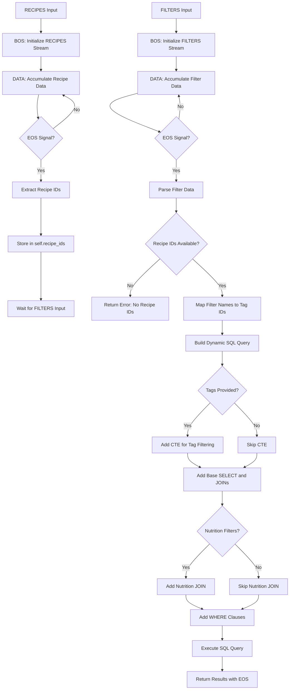

# Recipe Query Executor Agent

`Recipe Query Executor Agent` is a specialized SQL query builder and executor that filters recipes from a database based on user preferences. The agent accepts two inputs—**RECIPES** (from Recipe Retrieval Agent) and **FILTERS** (user preferences)—and dynamically generates optimized SQL queries to return matching recipe instructions. It uses CTEs, conditional JOINs, and WHERE clauses to build efficient queries based on tags, cook time, nutrition, and other criteria.

## Recipe Query Executor Agent in Action

<!-- TODO: Add demo GIF showing recipes + filters input and SQL execution -->
*Demo placeholder: Recipe IDs + User filters → Dynamic SQL generation → Filtered recipe instructions*

---

## Features

- **Dual Input Processing:** Accepts RECIPES input first to store recipe IDs, then processes FILTERS input to trigger query execution
- **Dynamic SQL Generation:** Builds optimized queries with only necessary JOINs and filters based on provided criteria
- **Multi-Criteria Filtering:** Supports tags, cook time, calories, ingredient count, steps, rating, and nutrition filters
- **Tag-Based CTE:** Uses Common Table Expressions for efficient multi-tag filtering (recipes must match ALL specified tags)
- **Database Integration:** Executes queries against the recipe database and returns structured results

---

## Input & Output

### Input

The agent expects **two inputs** via separate Blue stream channels:

#### RECIPES Input (from Recipe Retrieval Agent)

JSON object containing recipe IDs and metadata:

```json
{
  "count": 2,
  "results": [
    {
      "dish_name": "Spinach Mushroom Cheese Omelette",
      "query": "Spinach Mushroom Cheese Omelette",
      "count": 1,
      "recipes": [
        {
          "recipe_id": "177536",
          "dish_name": "veggie frittata with spinach and mushrooms",
          "ingredients": ["olive oil", "onion", "mushrooms", "spinach", "eggs", "cheese"],
          "missing_ingredients": ["olive oil", "onion"]
        }
      ]
    }
  ]
}
```

**Required fields:**
- `results`: Array of dish results
  - `recipes`: Array of recipe objects
    - `recipe_id`: Unique identifier for the recipe

#### FILTERS Input (from User Preferences Form)

JSON object containing user preferences:

```json
{
  "breakfast": true,
  "brunch": null,
  "main_dish": null,
  "savory": true,
  "cook_time": "30",
  "calories": "500",
  "steps": "10",
  "ingredients": "8",
  "rating": null
}
```

**Optional fields:**
- **Tag filters** (boolean): `breakfast`, `brunch`, `main_dish`, `side_dishes`, `appetizers`, `desserts`, `lunch`, `savory`, `sweet`, `spicy`, `comfort_food`, `romantic`
- **Numeric filters** (string or null):
  - `cook_time`: Maximum cook time in minutes
  - `calories`: Maximum calories per serving
  - `steps`: Maximum number of steps
  - `ingredients`: Maximum number of ingredients
  - `rating`: Minimum average rating

**Note:** The agent requires **RECIPES input to arrive before FILTERS**. When RECIPES is received, recipe IDs are stored and the agent waits. Query execution is triggered only when FILTERS input arrives with recipe IDs already available. If FILTERS arrives first, an error is returned.

### Output

JSON object containing SQL execution results:

```json
{
  "question": null,
  "source": "/Recipes/recipes/public",
  "query": "\nWITH\nrecipe_filtered_by_tags AS (\n    SELECT rt.recipe_id\n    FROM recipe_tags rt\n    WHERE rt.tag_id IN (22, 35)\n    GROUP BY rt.recipe_id\n    HAVING COUNT(*) = 2\n)\nSELECT DISTINCT r.recipe_id, r.instructions\nFROM recipes r\nJOIN recipe_filtered_by_tags rf ON rf.recipe_id = r.recipe_id\nJOIN nutrition n ON n.recipe_id = r.recipe_id\nWHERE r.recipe_id IN (177536, 342066) AND r.cook_time_min <= 30 AND r.num_steps <= 10 AND n.calories <= 500;\n",
  "result": [
    {
      "recipe_id": 177536,
      "instructions": "['preheat to 350 degrees', 'saute onion and mushrooms', 'add spinach', 'whisk eggs with cheese', 'pour into skillet', 'bake 15 minutes']"
    }
  ],
  "error": null
}
```

**Fields:**
- `question`: Always `null` (not used by this agent)
- `source`: Database path where query was executed
- `query`: The generated SQL query string
- `result`: Array of matching recipes with `recipe_id` and `instructions`
- `error`: Error message if query execution fails, otherwise `null`

---

## Properties

The agent extends [`QueryExecutorAgent`](https://blue.megagon.info/latest/references/blue/agents/query_executor.html) and supports all properties from the base class. Core properties are denoted in bold.

- **Database Configuration:**
  - **`source`**: Database to execute SQL query on (default: `"Recipes/recipes/public"`).

- **Query Building Configuration:**
  - Internal properties control SQL generation (no user-configurable properties for query building).

### Configuration (UI)

<!-- TODO: Add screenshot showing agent properties configuration in UI -->
*Users can modify the `source` property from the Blue platform UI to target different recipe databases.*

---

## Flow Diagram

Below is an overview of the process flow for the Recipe Query Executor agent:



---

## Code Structure of Recipe Query Executor Agent

The `RecipeQueryExecutorAgent` agent is defined in [recipe_query_executor.py](src/recipe_query_executor.py).

### Class Definition

- `RecipeQueryExecutorAgent` extends `QueryExecutorAgent` to provide recipe-specific query building and dual-input processing.

### Message Processing

- **`default_processor` method** handles incoming stream messages from two channels:
  - **RECIPES channel:**
    1. **BOS:** Initializes RECIPES stream buffer
    2. **DATA:** Accumulates recipe data
    3. **EOS:** Extracts recipe IDs, stores in `self.recipe_ids`, waits for FILTERS input
  - **FILTERS channel:**
    1. **BOS:** Initializes FILTERS stream buffer
    2. **DATA:** Accumulates filter data
    3. **EOS:** Checks if `self.recipe_ids` is available
       - If available: Triggers query execution and returns results
       - If not available: Returns error "No recipe IDs received"

### Core Methods

#### `build_and_execute_query(recipe_ids, filters)`

- Orchestrates the query building and execution workflow
- Calls `get_filter_query()` to generate SQL based on recipe IDs and filters
- Executes query using `execute_sql_query()` from parent class
- Returns structured result with query, results, and errors

#### `get_filter_query(recipe_ids, filters)`

- Maps filter field names to database tag IDs using category information
- Extracts numeric filters (cook_time, calories, steps, ingredients)
- Calls `build_recipe_filter_query()` with normalized parameters

#### `build_recipe_filter_query(...)`

- **Core SQL generation function** that dynamically builds queries
- Only includes necessary CTEs, JOINs, and WHERE clauses
- **Tag filtering:** Uses CTE with GROUP BY and HAVING to enforce ALL tags must match
- **Conditional JOINs:** Adds nutrition table JOIN only if nutrition filters are specified
- **Filters supported:**
  - `recipe_ids`: IN clause for recipe IDs
  - `tag_ids`: CTE-based multi-tag filtering
  - `cook_time_max`: Maximum cook time
  - `ingredient_count_max`: Maximum ingredient count
  - `num_steps_max`: Maximum step count
  - `avg_rating_min`: Minimum rating
  - `calories_max`, `saturated_fat_max`, `total_fat_max`, `protein_min`, `sugar_max`: Nutrition filters

#### `read_category_info()`

- Reads recipe category and tag metadata from JSON file
- Returns list of category dictionaries with tag IDs and names

#### `get_tag_lookup_query(recipe_ids)`

- Generates SQL to fetch all tags associated with given recipe IDs
- Used for QA and tag validation workflows

#### `get_tags_for_qa(tags_from_recipes, category_info)`

- Filters category information to only include tags present in specific recipes
- Used for generating user-facing filter options

### Performance Optimization

- **Conditional JOINs:** Only adds tables to query when necessary (e.g., nutrition table only if nutrition filters specified)
- **CTE for Tags:** Uses Common Table Expression for efficient multi-tag filtering
- **DISTINCT:** Ensures no duplicate recipe results

### Error Handling

- Validates that both RECIPES and FILTERS inputs are received
- Returns structured error messages for invalid input formats
- Handles JSON parsing errors gracefully
- Logs detailed information for debugging SQL generation

---

## Try it out

<!-- TODO: Add instructions for deploying and testing the agent -->

*To try out the Recipe Query Executor Agent:*

1. Deploy the agent to your Blue platform instance
2. Ensure recipe database is accessible at configured `source` path
3. Connect RECIPES input from Recipe Retrieval Agent
4. Connect FILTERS input from user preference form
5. Agent will execute query and return filtered recipe instructions

**Example Filter Combinations to Try:**

| **Filter Criteria** | **Expected Results** |
|---------------------|----------------------|
| `{"breakfast": true, "cook_time": "20"}` | Fast breakfast recipes under 20 minutes |
| `{"main_dish": true, "calories": "600", "ingredients": "10"}` | Main dishes under 600 calories with max 10 ingredients |
| `{"desserts": true, "sweet": true, "steps": "5"}` | Simple sweet desserts with 5 or fewer steps |
| `{"savory": true, "spicy": true, "cook_time": "30"}` | Spicy savory dishes ready in 30 minutes |
| `{"comfort_food": true, "rating": "4.5"}` | Highly-rated comfort food recipes |

**Expected Workflow:**

1. **Input:** Recipe IDs from Recipe Retrieval + User filter preferences
2. **Processing:** Agent maps filters to database schema, generates optimized SQL (~1 second)
3. **Execution:** Query executes against recipe database (~1-3 seconds depending on filters)
4. **Output:** Filtered recipe instructions with recipe IDs

**Performance Notes:**

- Typical execution time: 1-5 seconds depending on filter complexity and database size
- Tag-based filtering uses efficient CTE with GROUP BY
- Nutrition filters add JOIN overhead (~0.5-1 second)
