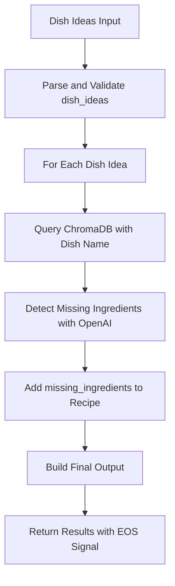

# Recipe Retrieval Agent

`Recipe Retrieval Agent` queries a ChromaDB-based vector database to retrieve similar recipes based on dish ideas. The agent accepts dish ideas (typically from the Dish Ideation Agent), queries ChromaDB for matching recipes, and uses OpenAI to intelligently detect missing ingredients by comparing user-provided ingredients with recipe requirements.

## Recipe Retrieval Agent in Action

<!-- TODO: Add demo GIF showing dish idea input and recipe retrieval with missing ingredients -->
*Demo placeholder: Dish ideas input → ChromaDB query → Recipes with missing ingredients detection*

---

## Features

- **Vector Database Integration:** Queries ChromaDB for semantically similar recipes based on dish names
- **Intelligent Missing Ingredients Detection:** Uses OpenAI to compare user ingredients with recipe requirements, considering substitutions and variations
- **Batch Processing:** Processes multiple dish ideas in a single request with individual `top_k` overrides
- **Automatic Fallback:** Tries multiple ChromaDB URL configurations for robust connectivity
- **Structured JSON Output:** Returns recipes with `recipe_id`, `dish_name`, `ingredients`, and `missing_ingredients`

---

## Input & Output

### Input

The agent expects a JSON object containing dish ideas (typically output from the Dish Ideation Agent):

```json
{
  "dish_ideas": [
    {
      "name": "Cheesy Bell Pepper Omelet",
      "short_description": "A fluffy omelet with colorful bell peppers and melted cheese",
      "ingredient_list": ["eggs", "bell peppers (any color)", "shredded cheese (cheddar or mozzarella)", "salt", "pepper", "butter"]
    },
    {
      "name": "Pasta Carbonara",
      "short_description": "Classic Italian pasta with bacon, eggs, and parmesan",
      "ingredient_list": ["pasta", "eggs", "bacon", "parmesan cheese"]
    }
  ]
}
```

**Required fields (per dish idea):**
- `name` (string): The name of the dish to search for

**Optional fields (per dish idea):**
- `short_description` (string): Description of the dish (ignored by agent, passed through from Dish Ideation)
- `ingredient_list` (array): List of ingredients the user has available
- `top_k` (integer): Override number of recipes to return (1-20, default 1)

### Output

- Message content (JSON):
```json
{
  "count": 2,
  "results": [
    {
      "dish_name": "Cheesy Bell Pepper Omelet",
      "query": "Cheesy Bell Pepper Omelet",
      "count": 1,
      "ingredient_list": ["eggs", "bell peppers", "cheese"],
      "recipes": [
        {
          "recipe_id": "42126",
          "dish_name": "Bell Pepper and Cheese Omelet",
          "ingredients": ["eggs", "bell peppers", "cheese", "butter", "salt"],
          "missing_ingredients": ["butter"]
        }
      ]
    },
    {
      "dish_name": "Pasta Carbonara",
      "query": "Pasta Carbonara",
      "count": 1,
      "ingredient_list": ["pasta", "eggs", "bacon"],
      "recipes": [
        {
          "recipe_id": "12345",
          "dish_name": "Classic Carbonara",
          "ingredients": ["pasta", "eggs", "bacon", "parmesan", "black pepper"],
          "missing_ingredients": ["parmesan", "black pepper"]
        }
      ]
    }
  ]
}
```

**Note:** The `missing_ingredients` field is only included when the input contains an `ingredient_list` array. This feature uses OpenAI (gpt-4.1-mini) to intelligently compare input ingredients with recipe requirements, considering common substitutions and variations.

---

## Properties

The agent uses a set of properties to control ChromaDB queries and missing ingredients detection. The agent extends [`OpenAIAgent`](https://blue.megagon.info/latest/references/blue/agents/openai.html) and **supports all properties from the base OpenAIAgent class**. Core properties are denoted in bold.

- **ChromaDB Configuration:**
  - **`chromadb_url`**: URL of the ChromaDB API server (`http://host.docker.internal:8000`).
  - **`top_k`**: Number of recipes to return per dish idea (`1`).
  - `source`: Optional source filter for recipes (`null`).
  - `timeout`: Request timeout in seconds (`30`).

- **OpenAI API Configuration:**
  - `service_url`: WebSocket URL for the OpenAI service (`ws://blue_service_openai:8001`).
  - `openai.model`: OpenAI model for ingredient comparison (`gpt-4.1-mini`).
  - `openai.temperature`: Temperature for deterministic output (`0.0`).
  - `openai.max_tokens`: Max tokens for OpenAI response (`500`).

- **Prompt Configuration:**
  - `missing_ingredient_detection_prompt_template`: Instructions for detecting missing ingredients (supports `${input}` and `${recipe_ingredients}` variables).
  - `missing_ingredient_detection_response_format`: JSON schema definition for missing ingredients list.

### Configuration (UI)

<!-- TODO: Add screenshot showing agent properties configuration in UI -->
*Users can modify all agent properties from the Blue platform UI to customize ChromaDB connection, adjust top_k defaults, and fine-tune prompt templates for missing ingredients detection.*

---

## Flow Diagram

Below is an overview of the process flow for the Recipe Retrieval agent:



---

## Code Structure of Recipe Retrieval Agent

The `RecipeRetrievalAgent` agent is defined in [recipe_retrieval_agent.py](src/recipe_retrieval_agent.py).

### Class Definition

- `RecipeRetrievalAgent` extends `OpenAIAgent` to leverage GPT models for intelligent ingredient comparison.

### Message Processing

- **`default_processor` method** handles incoming stream messages:
  1. **BOS (Begin of Stream):** Initializes accumulator for dish ideas data
  2. **DATA:** Accumulates dish ideas data from the stream
  3. **EOS (End of Stream):** Triggers the main workflow:
     - Parse and validate accumulated dish ideas
     - Query ChromaDB for each dish
     - Detect missing ingredients if ingredient_list provided
     - Return structured output with EOS signal

### Core Methods

#### `_query_chromadb(query, top_k, source)`

- Queries the ChromaDB vector database with automatic URL fallback
- Tries multiple URL configurations if initial connection fails
- Returns list of recipe dictionaries with `recipe_id`, `dish_name`, and `ingredients`

#### `_extract_recipe_info(api_response)`

- Extracts standardized recipe information from ChromaDB API response
- Handles multiple response formats (list, dict, nested document structure)
- Normalizes field names (`recipe_id`, `dish_name`, `ingredients`)

#### `_detect_missing_ingredients(input_ingredients, recipe_ingredients, properties)`

- Uses OpenAI to intelligently compare ingredient lists
- Considers common substitutions and variations (e.g., "egg" matches "eggs")
- Returns dict with `missing_ingredients` array

#### `_validate_dish_idea(dish_idea)`

- Validates individual dish idea structure
- Ensures required `name` field exists and is a string
- Validates optional `ingredient_list` and `top_k` fields
- Returns validated dictionary

#### `_validate_ingredient_list(ingredient_list)`

- Validates that ingredient_list is an array of strings
- Raises `ValueError` for invalid types

#### `_validate_topk_override(top_k_value)`

- Validates that top_k is an integer between 1 and 20
- Raises `ValueError` for out-of-range values

### Error Handling

- Gracefully handles connection errors with multiple URL fallback attempts
- Returns structured error messages for invalid input formats
- Logs warnings for JSON parsing and API errors
- Prevents downstream crashes with empty list returns on failure

---

## Try it out

<!-- TODO: Add instructions for deploying and testing the agent -->

*To try out the Recipe Retrieval Agent:*

1. Deploy the agent to your Blue platform instance
2. Ensure ChromaDB vector database server is running with recipe data
3. Provide dish ideas (e.g., from the Dish Ideation Agent output)
4. The agent will retrieve matching recipes with missing ingredients detection

**Example Dish Ideas to Try:**

| **Input Dish Ideas** | **Expected Output** |
|----------------------|---------------------|
| `{"dish_ideas": [{"name": "Chicken Fried Rice", "ingredient_list": ["chicken", "rice", "eggs", "soy sauce"]}]}` | Similar fried rice recipes with missing ingredients (e.g., garlic, ginger, scallions) |
| `{"dish_ideas": [{"name": "Pasta Carbonara", "ingredient_list": ["pasta", "eggs", "bacon"]}]}` | Classic carbonara recipes with missing ingredients (e.g., parmesan, black pepper) |
| `{"dish_ideas": [{"name": "Tacos", "ingredient_list": ["ground beef", "tortillas", "cheese"]}]}` | Various taco recipes with missing ingredients (e.g., lettuce, salsa, sour cream) |
| `{"dish_ideas": [{"name": "Omelet"}, {"name": "Scrambled Eggs"}]}` | Multiple egg-based recipes without missing ingredients detection |

**Expected Workflow:**

If default properties are used, the typical workflow is:

1. **Input:** JSON object with 10-20 dish ideas
2. **Processing:** Agent queries ChromaDB for each dish
3. **Missing Ingredients Detection:** If ingredient_list provided, OpenAI compares ingredients
4. **Output:** Structured JSON with recipes and missing ingredients

**Performance Notes:**

- ChromaDB query latency depends on database size and network connection
- OpenAI API calls for missing ingredients are sequential per recipe

---

## API Reference

The agent calls the ChromaDB vector database server with the following request:

```
POST /query
Content-Type: application/json

{
  "query": "Cheesy Bell Pepper Omelet",
  "top_k": 1,
  "source": null
}
```

**Response Format:**

The ChromaDB API returns recipe documents with the following structure:
- `recipe_id`: Unique identifier for the recipe
- `dish_name`: Name of the dish
- `ingredients`: Array of ingredient strings
