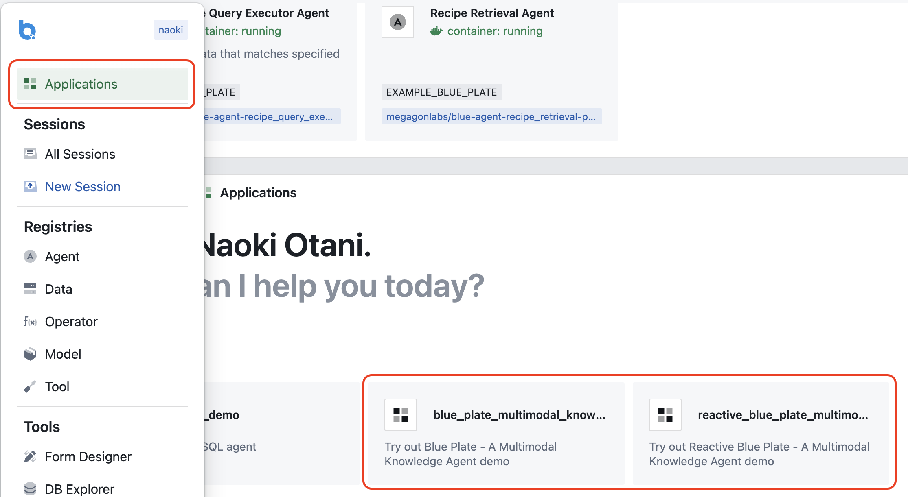
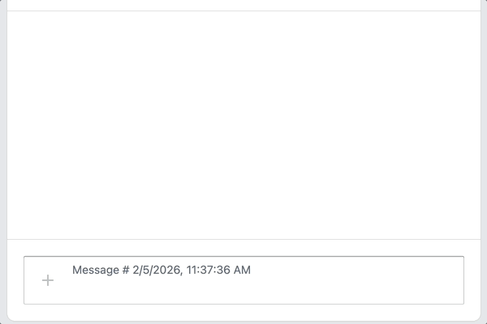
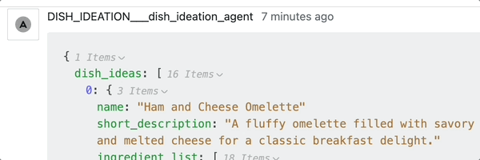
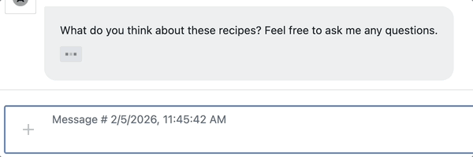
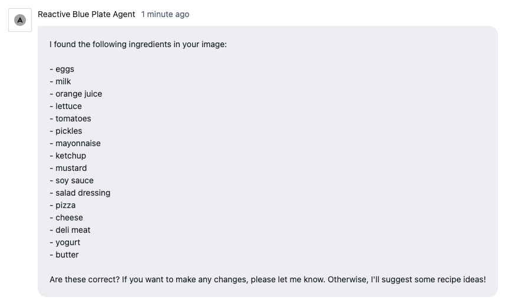
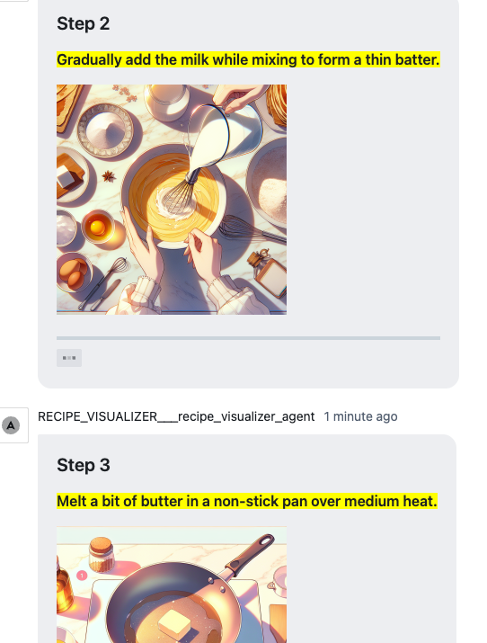

# Demo Example - WIP

## Scenario

Traditional recipe apps can be rigid, *often requiring specific ingredients you don't have.* The **Multimodal Knowledge Agent** solves this by acting as an intelligent kitchen assistant that **helps you cook with what's already in your fridge!** It combines visual perception with a verified recipe database to provide reliable, personalized suggestions.

The workflow is simple and intuitive:

1.  **Visual Ingredient Extraction**: Upload a photo of your open fridge, and the agent automatically identifies available ingredients.
2.  **Recipe Search**: Instead of guessing, it retrieves matching recipes from a verified database based on your ingredients.
3.  **Smart Filtering**: You can refine the results with natural language preferences like "healthy breakfast" or "savory dinner."
4.  **Interactive Cooking**: Once you pick a dish, the agent guides you with step-by-step instructions, answers your questions, and generates helper images to make cooking easy.

## Demo Instructions

**Prerequisites**: Make sure you have completed the installation and setup steps outlined in [`installation.md`](installation.md), including database setup, agent building, registration, and deployment.


After loading `agent.json` to register agents, you will also see the Multimodal Knowledge Agent examples under "Applications":



These predefined examples set up a session with a predefined bundle of agents.


### 1. Fixed Workflow Example (The [Blue Plate](agents/blue_plate/) agent)

Start with the fixed workflow example:

1. **Launch the Agent**: Double-click "blue_plate_multimodal_knowledge_agent" to start a session.

2. **Upload a Fridge Photo**: Click the "+" > "File" button in the chat input to upload a photo of your fridge.

    

3. **Ingredient Extraction**: The [Ingredient Extractor agent](agents/ingredient_extractor/) analyzes the photo and lists the detected ingredients. Example output:

    ```json
    {
         "ingredients": ["eggs", "milk", "orange juice", "lettuce", "tomatoes", "pizza", "mayonnaise", "mustard", "ketchup", "salad dressing", "hot sauce", "pickles", "butter", "cheese", "deli meat", "yogurt", "salsa"]
    }
    ```

4. **Dish Ideation & Recipe Retrieval**: The [Dish Ideation agent](agents/dish_ideation/) suggests dish ideas using the extracted ingredients. These are then used by the [Recipe Retrieval agent](agents/recipe_retrieval/) to find matching recipes in the database.

    

> [!NOTE]
> **Why "Dish Ideation" before "Recipe Retrieval"?** This step avoids trivial matches (e.g., "milk") and broadens the variety of suggested dishes.

5. **Filter by Preference**: Enter your preferences (e.g., "Main Dish") in the UI form to filter the recipe results. The [RecipeQueryExecutor](agents/recipe_query_executor/) agent will query the database and return recipes that match the specified preference criteria.

    

6. **View and Interact with Recipes**: The agent presents a matched recipe based on your ingredients and preferences, for example:

    > **1. Sweet Crepes**
    >
    > *Ingredients*: Flour, Milk, Eggs, Butter, Sugar, Vanilla, Fruit
    >
    > *Missing Ingredients*: Flour, Butter, Sugar, Vanilla, Fruit
    >
    > *Instructions*: [...]

    You can also ask questions about the recipe, and the agent will respond.

    


### 2. Dynamic Workflow Example (The [Reactive Blue Plate](agents/reactive_blue_plate/) agent)

1. **Launch the Dynamic Agent**: Double-click "reactive_blue_plate_multimodal_knowledge_agent" to start a session. *(Same as Fixed Workflow)*

2. **Upload a Fridge Photo**: Click the "+" > "File" button in the chat input to upload a photo of your fridge. *(Same as Fixed Workflow)*

3. **Confirm Ingredients**: Unlike the fixed workflow, this agent asks you to confirm the extracted ingredients before proceeding. Type "yes" to confirm, or edit the list by adding/removing ingredients directly in the chat (e.g., "I have butter and strawberries").

    

4. **Recipe Retrieval and Filtering**: After confirmation, the agent retrieves recipes and allows you to filter results by entering your preferences (e.g., "Main Dish") in the UI form. *(Same as Fixed Workflow)*

5. **View and Interact with Recipes**: The agent presents a matched recipe based on your ingredients and preferences. You can ask questions about the recipe, and the agent will respond. *(Same as Fixed Workflow)*

6. **Generate Helper Images**: Ask the agent to generate helper images for the recipe (e.g., "Can you show me how to cook sweet crepes?"). The [Recipe Visualizer](agents/image_generator/) agent will generate and display images step by step. Image generation may take a moment for each step. *(New: Only available in Dynamic Workflow)*

    
