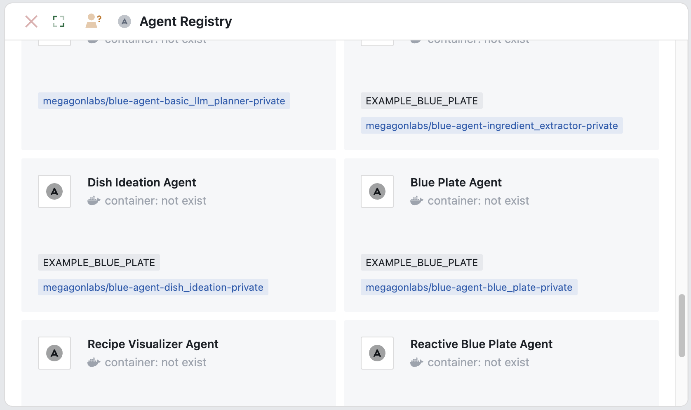
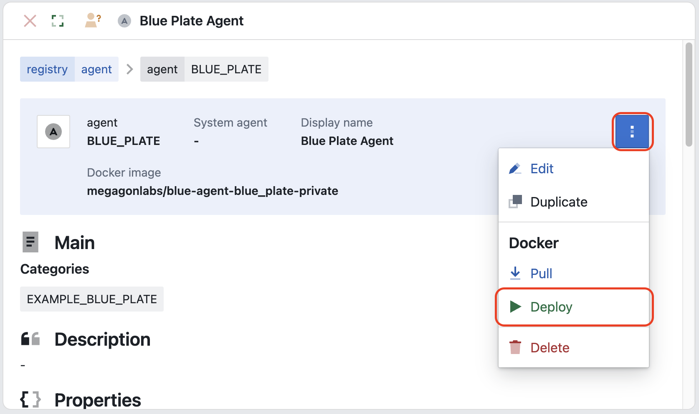
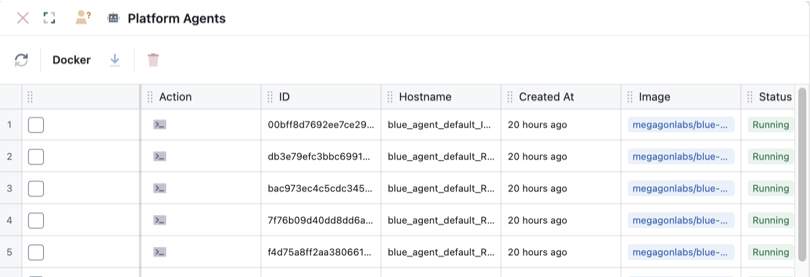

# Installation

## Prerequisites

- Python >= 3.10
- blue_cli >= 1.1
- blue_platform >= 1.1
- OpenAI API key

- **Blue package installation and running**, see the official docs: [Quickstart guide](https://blue.megagon.info/latest/quickstart.html).  The install includes Blue CLI which is required for agent registration.  
- **OpenAI API key** - Required for LLM-powered agents

## Installation Steps

### 1. Database Setup

We have provided some preprocessed example synthetic data files under: `../data/recipes/processed`

#### 1.1 Postgres set up (via Blue UI)

1. Create a new database `recipes_example` on the existing postgres shipped with Blue.

```bash
docker exec -it "$(docker ps -q --filter 'ancestor=postgres:16.0' | head -n 1)" \
psql -U postgres -c "CREATE DATABASE recipes_example;"
```

2. Upload the example data into the database

```bash
docker exec -i "$(docker ps -q --filter 'ancestor=postgres:16.0' | head -n 1)" psql -U postgres -d recipes_example < "data/recipes/processed/asian_recipes_sample_dump.sql"
docker exec -i "$(docker ps -q --filter 'ancestor=postgres:16.0' | head -n 1)" psql -U postgres -d recipes_example < "data/recipes/processed/other_recipes_sample_dump.sql"
```

3. List databases to validate that the new database `recipes_example` has been created 

```bash
docker exec -i "$(docker ps -q --filter 'ancestor=postgres:16.0' | head -n 1)" psql -U postgres -c "\l"
```

Next we will enable agents to discover this data:

4. Open the Blue web application and log in
5. Navigate to **Data** under registries
6. Click on `postgres_example` dataset in the registry
7. Select **Actions** → **Synchronize**
8. Reload the page - you should now see the `recipes_example` database listed under **Databases**

#### 1.2. ChromaDB set up

##### 1. Install dependencies

```bash
pip install chromadb fastapi uvicorn openai requests uv
export OPENAI_API_KEY="your-api-key-here"
```

##### 2. Start the server

```bash
cd db
./start_vector_db.sh
```

The server will start at `http://localhost:8000` and automatically index the example data.

##### 3. Verify ChromaDB is working

Check server health:
```bash
curl http://localhost:8000/
```

Expected response:
```json
{
    "status": "ok",
    "message": "Vector Database API is running",
    "indexed_documents":6,
    "indexed_sources":["example_asian_recipes_pct10.jsonl","example_other_recipes_pct10.jsonl"]
}
```

If you want to use the full data, follow the instructions at [`db/README.md`](db/README.md)

### 2. Register Agents

Register all agents using the provided configuration:

```bash
cd blue-examples/demos/multimodal_knowledge_agent
blue registry agent update agent.json
```

This creates registry entries from `agent.json`:



Note: that during the agent registration process:
1. You will need to login via the browser
2. You will need to then return to the CLI to confirm the agent registry changes

### 3. Pull and Deploy Agents

Pull the agent images:

```bash
docker pull megagonlabs/blue-agent-ingredient_extractor:v1.1 &&
docker pull megagonlabs/blue-agent-dish_ideation:v1.1 &&
docker pull megagonlabs/blue-agent-blue_plate:v1.1 &&
docker pull megagonlabs/blue-agent-image-generation:v1.1 &&
docker pull megagonlabs/blue-agent-reactive_blue_plate:v1.1 &&
docker pull megagonlabs/blue-agent-recipe_query_executor:v1.1 &&
docker pull megagonlabs/blue-agent-recipe_retrieval:v1.1
```

In the Blue UI (`http://localhost:3000`):

1. Navigate to **Agents** 
3. Deploy the following agents:
    - Blue System Agents:
        - `Task Coordinator Agent`
        - `Presenter Agent`
    - Demo-specific Agents:
        - `Blue Plate Agent`
        - `Reactive Blue Plate Agent`
        - `Ingredient Extractor Agent`
        - `Recipe Retrieval Agent`
        - `Dish Ideation Agent`
        - `Recipe Query Executor Agent`
        - `Recipe Visualizer Agent`



3. Verify all agents showing as "Running"

    - Navigate to **Agents** under platform
    - Verify all agents are showing as "Running"



See [`demo_example.md`](demo_example.md) for usage examples.
