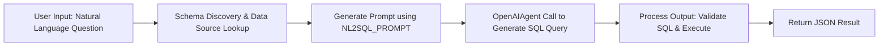

# Natural Language to SQL (NL2SQL)

`NL2SQL` is an agent designed to convert natural language questions into SQL queries. The agent leverages a data registry to discover relevant data sources using embedding-based methods. It then uses a prompt-driven approach via an OpenAI API agent to generate SQL queries that are both syntactically and semantically aligned with the underlying data source.

## NL2SQL Agent in Action

The following animation displays the user asking a natural language question over a database of job posting data in Singapore. 


---

## Features

- **Natural Language to SQL Translation:** Converts user questions into executable SQL queries.
- **Schema Discovery:** Searches and discovers relevant schemas from a data collection based on similarity to the question.
- **Dynamic Data Source Selection:** Identifies the appropriate data source (including databases and collections) by parsing the discovery scope.
- **Prompt Customization:** Uses a detailed prompt template (NL2SQL_PROMPT) that includes context, protocol, and additional requirements.
- **Query Execution:** Optionally executes the generated SQL query against the selected data source and returns the results.

---

## Input & Output

### Input

- **Natural Language Question:** A text string representing the user's question.
- **Context (Optional):** Additional context that might aid in generating the correct SQL.
- **Data Sources & Schemas:** Automatically retrieved from the data registry if discovery is enabled. These include:
  - **Source name**
  - **Database name**
  - **Collection name** (if applicable)
  - **Table schemas** (listing table names and columns)

### Output

The agent outputs a JSON object containing the following fields:

```json
{
  "question": "<Original natural language question>",
  "source": "<Data source identifier>",
  "query": "<Generated SQL query>",
  "result": "<Query execution result, if execution enabled>",
  "error": "<Error message, if any>"
}
```

---

## Properties

The agent uses a set of properties to control its behavior. Key properties include:

- **OpenAI API Configuration:**
  - `openai.api`: Specifies the API to use (e.g., "ChatCompletion").
  - `openai.model`: Model selection such as `"gpt-4o"`.
  - `openai.temperature`: Set to `0` for deterministic outputs.
  - `openai.max_tokens`: Limits the number of tokens (e.g., `512`).

- **Input/Output Settings:**
  - `output_path`: JSONPath to extract the generated output.
  - `input_json`, `input_context`, `input_context_field`, `input_field`: Define how input data is structured.
  - `input_template`: Uses the `NL2SQL_PROMPT` which embeds the protocols, data sources, context, and the question.

- **SQL Query Requirements:**
  - `nl2q_valid_query_prefixes`: Valid SQL prefixes (e.g., "SELECT") to ensure query correctness.
  - `nl2q_force_query_prefixes`: Forces queries to start with allowed prefixes.
  - `nl2q_additional_requirements`: List of additional constraints to be applied during query generation.

- **Discovery and Schema Settings:**
  - `nl2q_discovery`: Boolean flag to enable or disable schema discovery.
  - `nl2q_discovery_similarity_threshold`: Threshold for schema matching (e.g., `0.2`).
  - `nl2q_discovery_source_protocols`: Supported protocols for discovery (e.g., `["postgres", "mysql"]`).
  - `nl2q_case_insensitive`: Determines if string comparisons in SQL should be case-insensitive.

- **Execution Settings:**
  - `nl2q_execute`: If true, the generated SQL query is executed on the selected data source.
  - `output_transformations`: Specifies text transformations on the output (e.g., removal of markdown code fences).

These properties are initialized in the `agent_properties` dictionary and then loaded into the agent during its initialization phase.

### Configuration (UI)

Users can also modify the `agent_properties` dictionary to suit your OpenAI API keys, discovery settings, and execution preferences from the UI. 


---

## Flow Diagram

Below is an overview of the process flow for the NL2SQL agent:



---

## Code Structure of Base NL2SQL Agent

The base `NL2SQL` agent is defined [here](https://github.com/rit-git/blue/blob/dev/lib/blue/agents/nl2q.py)

- **Initialization:**
  - The agent class `NL2SQLAgent` extends `OpenAIAgent` and initializes by setting default properties and establishing the data registry.
- **Registry & Schema Setup:**
  - Methods such as `_init_registry`, `_init_source`, and `_init_schemas` load data sources and their schemas from the registry.
- **Input Processing:**
  - `extract_input_params` compiles the question, relevant schemas, and additional context into parameters for prompt generation.
- **SQL Generation & Execution:**
  - The agent generates a SQL query via an OpenAI API call using a detailed prompt template.
  - `process_output` validates the generated SQL (ensuring it starts with a valid prefix) and, if configured, executes the query against the data source.
- **Schema Discovery:**
  - If enabled, the agent uses `_search_schemas` to perform an embedding-based search over the registry for schemas related to the input question.

---

## Try it out

To try out the agent, first follow the quickstart guide to install the Blue platform and example datasets.

| **Natural Language Utterance** | **SQL** |
|--------------------------------|---------|
| what is the most frequently advertised manager role in jurong? | ```SELECT short_job_title, COUNT(*) AS frequency FROM jobs WHERE lower(location) = 'jurong' AND lower(short_job_title) LIKE '%manager%' GROUP BY short_job_title ORDER BY frequency DESC LIMIT 1;``` |
| what is the average minimum salary of project manager jobs in jurong? | ```SELECT AVG(min_salary) AS average_min_salary FROM jobs WHERE LOWER(short_job_title) = 'project manager' AND LOWER(location) = 'jurong';``` |
| what are the top 10 project manager jobs in jurong with a minimum salary of 4000? | ```SELECT job_title, min_salary, location FROM jobs WHERE short_job_title ILIKE '%project manager%' AND location ILIKE '%jurong%' AND min_salary >= 4000 ORDER BY min_salary DESC LIMIT 10;``` |
| what are the top 10 full time project manager jobs in jurong with a minimum salary of 4000? | ```SELECT job_title, min_salary, location FROM jobs WHERE employment_type ILIKE 'full time' AND short_job_title ILIKE 'project manager' AND location ILIKE 'jurong' AND min_salary >= 4000 ORDER BY min_salary DESC LIMIT 10;``` |
| what skills are typically required for a project manager job? | ```SELECT skill_required FROM frequent_skills_by_title WHERE LOWER(short_job_title) = LOWER('project manager');``` |
| what are the 5 most on demand skills for a project manager job? | ```SELECT skill_required FROM frequent_skills_by_title WHERE LOWER(short_job_title) = 'project manager' ORDER BY frequency DESC LIMIT 5;``` |
| if someone possesses the project planning skill, what other skill are they most likely to possess? | ```SELECT skill_2 FROM frequent_skill_pairs WHERE LOWER(skill_1) = 'project planning' ORDER BY frequency DESC LIMIT 1;``` |
