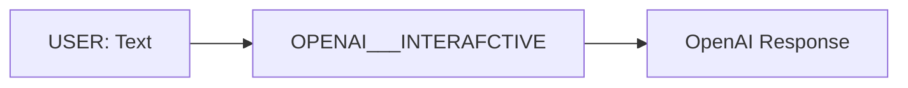

# OpenAI Agent

OpenAI is an agent to demonstrate basic functioning of an LLM-based agent. It simply sets various properties for OpenAI api, using the prefix `openai.`. For example `openai.model: "gpt-4o"` sets the model to use. Incoming data from the input stream is substituted in the prompt and response from OpenAI API is added to the output stream. 

The following animation displays a user entering some text and the OpenAI agent responding.

---

## Features

- **Tool Use:** Uses tools for some functionality

---

## Input & Output

### Input

- **User Text:** A text string representing the user's input.

### Output

The agent outputs a OpenAI response.

---

## Properties

- **Listener:**
  - `listens.DEFAULT`: Includes "USER" to listen to USER agent output

### Configuration (UI)

See registry entry for `OPENAI`, `OPENAI___Interactive`, and `OPENAI___TOOL_EXAMPLE`.

---

## Flow Diagram

Below is an overview of the process flow for the Counter agent:

## Try it out

To try out the agent, first follow the [quickstart guide](https://github.com/rit-git/blue/blob/dev/QUICK-START.md) to deploy the agent. You will also need to have the `OPENAI` Service running. See the installation guide for starting the service. 

Once deployed create a new session and add the `OPENAI Interactive Agent with Tools` (`OPENAI___TOOL_EXAMPLE`) agent to the session.

You can optionally set the `tool_servers` property to `deep_wiki` if you want to target only `deep_wiki` MCP Server.

In the UI, enter some text, for example asking a question about a git repo, e.g. `Who is the top contributor to the pytorch repo`

You can examime the tool call in the UI to see what function was called and what the response was.
