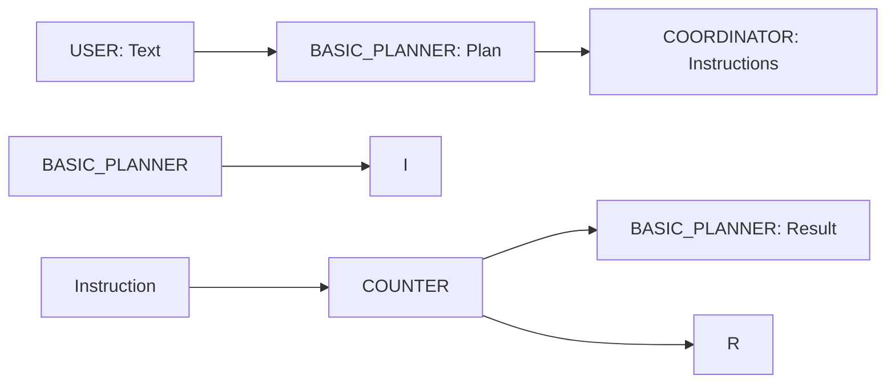

# Summarizer

Summarizer is an agent that has a built in template property (`template`) first for creating text from data that is populated from query results and then uses `OPENAI` to summarize content in the document through separate instructions.

Queries can either be specified in natural language or SQL, through `questions` and `queries` properties. Each question (or query) in these properties have an id and the corresponding natural language question or sql query (optionally source for SQL). Once all queries are executed the template can refer to query results through these ids within the template. The text template is expressed in [Jinja](https://jinja.palletsprojects.com/en/stable/). 

The following animation displays a summarizer agent issuing a single natural language query and rendering a summarized text with the query result:

---

## Features

- **Natural Language Queries:** Allows users to specify any number of natural language queries
- **SQL Queries:** Allows users to specifies queries directly in SQL
- **Coordinator Agent:** Uses coordinator agent to instruct NL2SQL (for NL queries) and QUERY_EXECUTOR (for SQL queries) agents.
- **Templates:** Uses templates where data from queries can be substituted
  
---

## Input & Output

### Input

- **DEFAULT:** Triggers execution of queries.

### Output

- **DEFAULT:** Summarized text

---

## Properties
 
- `template`: Jinja specification of text, with substitutions for ids for each each query results
- `questions`: id and question pairs expressed in natural language
- `queries`: id and query pairs expressed in SQL

---

## Flow Diagram

Below is an overview of the process flow for the Summarizer agent:

---

## Code Overview

The `SUMMARIZER` agent is defined [here](https://github.com/rit-git/blue/blob/v0.9/lib/blue/agents/summarizer.py))

- **Processing:**
  - Iterate over all questions:
    - Create a plan for each question invoking the `NL2SQL` agent
    - Store query result by query id
  - Iterate over all queries:
    - Create a plan for each query invoking the `QUERY_EXECUTOR` agent
    - Store query result by query id
  - Subsitute query results in template by the respective query ids
  - Use `OPENAI` to summarize text
  - Render text

---

## Try it out

To try out the agent, first follow the [quickstart guide](https://github.com/rit-git/blue/blob/v0.9/QUICK-START.md) to deploy the `Summarizer Skill Agent` (`SUMMARIZER___SKILL`), `Task Coordinator Agent` (`COORDINATOR`), `Query Executor Agent` (`QUERY_EXECUTOR`),  and `NL-to-SQL Agent` (`NL2SQL`).

Once deployed create a new session and add the above agents to the session. 

In the UI, enter some text.

| **User Input** | **Result** |
|--------------------------------|---------|
| 'software engineer' | summarized text |

